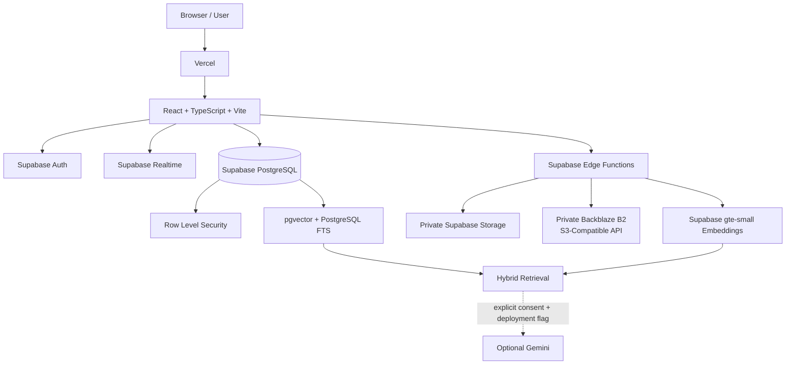
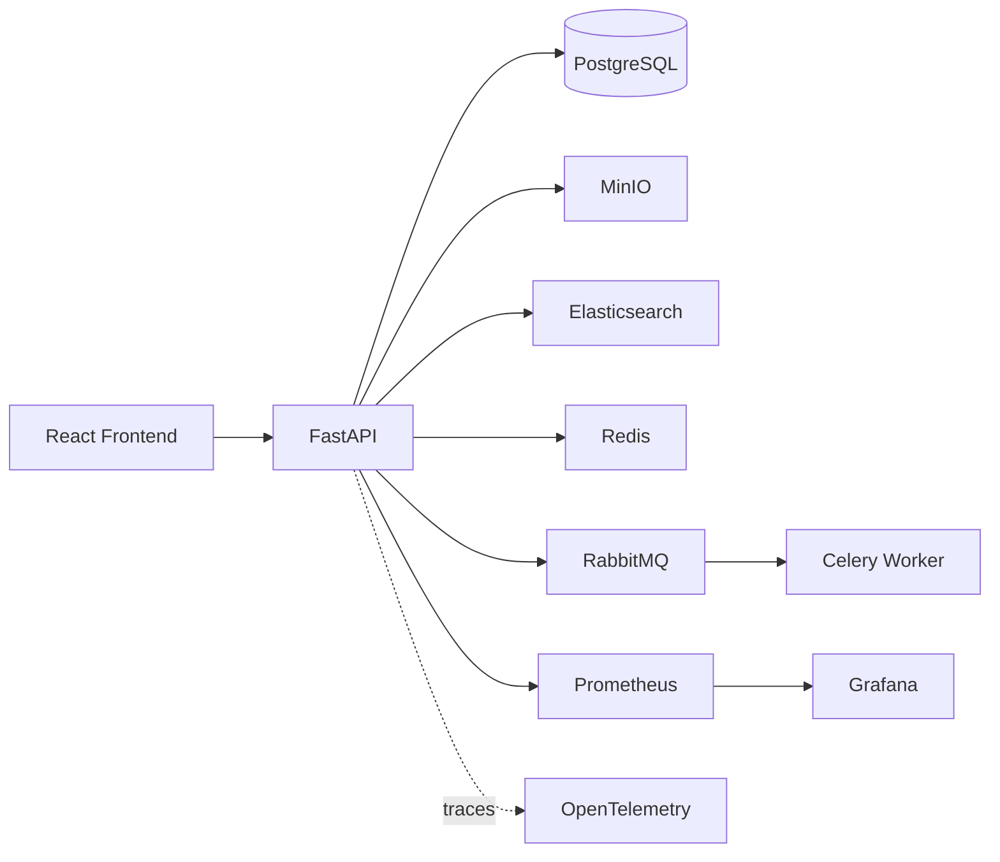
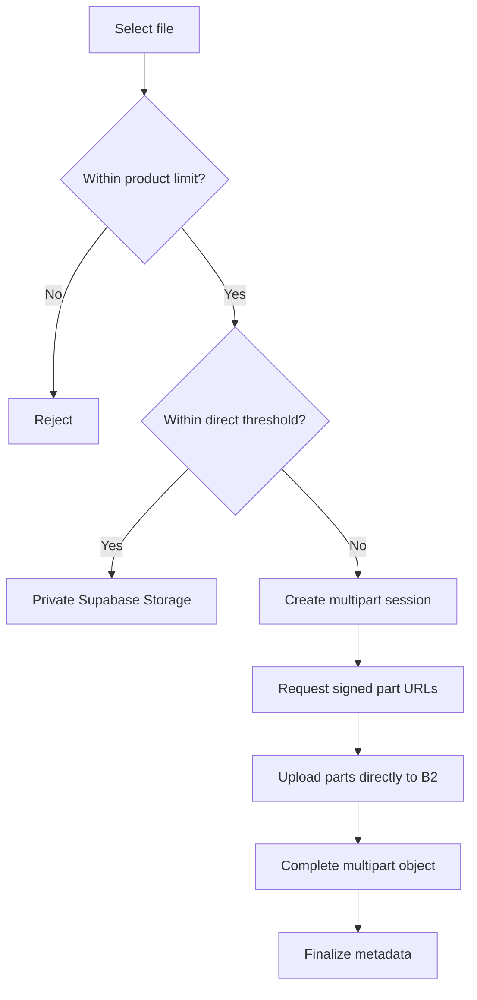
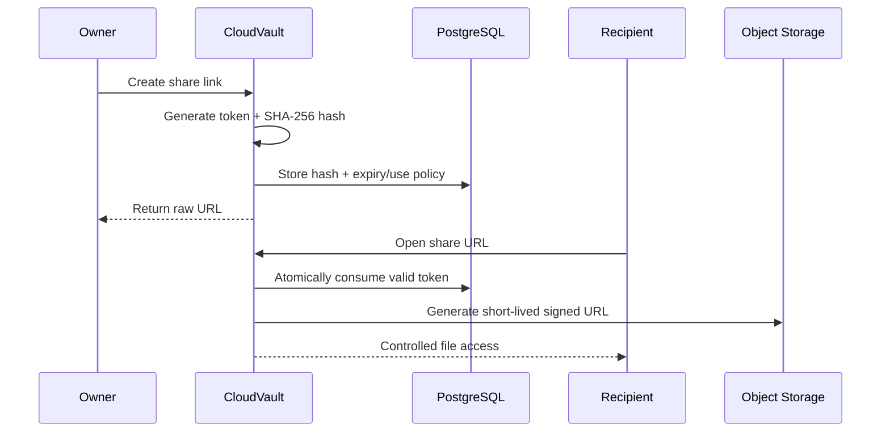
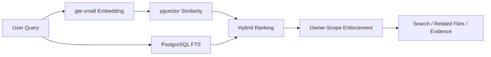

<div align="center">

# CloudVault

### Secure, Private and Intelligent Distributed Cloud Storage Platform

**Per-user isolation · Realtime state · File versioning · Secure sharing · Resumable large-file architecture · Hybrid retrieval · Observability · CI/CD**

[](https://github.com/adityamsr2606/CloudVault-Distributed-Cloud-Storage-Platform/actions/workflows/ci.yml)


**[Live Application](https://cloudvault-distributed-cloud-storag.vercel.app/)**

**[Production Validation](docs/PRODUCTION_VALIDATION.md)** · **[Backblaze B2 Setup](docs/B2_SETUP.md)**

</div>

---

## Overview

CloudVault is a full-stack cloud storage platform focused on **privacy, recoverability, large-object storage, secure sharing, intelligent retrieval, and production engineering**.

It combines a hosted product architecture with a local distributed-systems profile while keeping the same core principles:

- owner-isolated storage
- private object access
- provider-aware file lifecycle
- resumable multipart uploads
- immutable version history
- secure temporary sharing
- realtime state
- permission-aware hybrid retrieval
- MFA and database-level authorization
- CI, testing, observability, and production validation

> **Core security rule:** a signed-in user can discover and access only the data they own unless they deliberately expose a specific file through a controlled temporary share link.

---

## Core Capabilities

<table>
<tr>
<td width="50%" valign="top">

### Storage and Lifecycle

- Private per-user vault
- Nested folders
- Direct + multipart uploads
- Pause, resume, cancel and retry
- Multipart recovery
- Immutable file versions
- Restore older versions
- Starred files
- File and folder Trash
- Provider-aware permanent purge

</td>

<td width="50%" valign="top">

### Security

- Supabase Auth
- TOTP MFA and AAL2
- PostgreSQL Row Level Security
- Private object storage
- Server-side provider credentials
- Signed URLs
- SHA-256 share-token hashing
- Feature-gated passkeys

</td>
</tr>

<tr>
<td width="50%" valign="top">

### Secure Sharing

- Expiring public links
- Usage limits
- Revocation
- Atomic usage counters
- Short-lived signed download URLs
- Provider-aware file resolution

</td>

<td width="50%" valign="top">

### CloudVault Intelligence

- Semantic search
- PostgreSQL full-text search
- pgvector
- `gte-small` embeddings
- Hybrid ranking
- Related-file discovery
- Grounded evidence retrieval
- Optional consent-gated Gemini generation

</td>
</tr>
</table>

---

## Product Experience

CloudVault includes a responsive product interface with:

- Light, Dark and System themes
- desktop, tablet and mobile layouts
- private authenticated workspace
- nested folder navigation
- realtime file and folder updates
- activity history
- Trash and version management
- secure sharing
- CloudVault Intelligence
- route-level lazy loading
- reduced-motion support

---

# Architecture

CloudVault intentionally keeps **two runtime profiles** without mixing their responsibilities.

## Hosted Product Profile

**Vercel + React + TypeScript + Supabase + Backblaze B2**



| Layer | Responsibility |
|---|---|
| Vercel | Frontend hosting and SPA delivery |
| React + TypeScript | UI, routing, state and upload orchestration |
| Supabase Auth | Authentication, sessions, recovery and MFA |
| PostgreSQL + RLS | Owner-scoped application metadata and authorization |
| Supabase Realtime | Live product state |
| Supabase Storage | Private direct object storage |
| Backblaze B2 | Private S3-compatible large-object storage |
| Edge Functions | Trusted storage, sharing, search and lifecycle workflows |
| pgvector + FTS | Semantic and lexical retrieval |
| Gemini | Optional grounded generation with explicit consent |

The browser never receives Supabase service-role credentials or long-lived Backblaze secrets.

---

## Local Distributed-Systems Profile

**FastAPI + PostgreSQL + MinIO + Redis + RabbitMQ + Celery + Elasticsearch + Prometheus + Grafana + OpenTelemetry**



This profile keeps asynchronous workers, queues, object storage, search, metrics and tracing independently observable and locally reproducible.

---

# Large-File Storage

CloudVault separates the **product upload ceiling**, **direct-upload limit**, and **large-object provider**.

## Current Runtime Policy

| Setting | Value |
|---|---:|
| Product upload ceiling | 1.5 GiB per file |
| Direct Supabase threshold | 50 MB |
| Large-object provider | Backblaze B2 |
| Multipart part size | 16 MiB |
| Multipart parallelism | 3 |
| Retry attempts per failed part | 4 |

Files at or below the direct threshold use private Supabase Storage. Larger files are routed through the B2 multipart path.



### Multipart Design

Large uploads support:

- parallel part uploads
- pause/resume
- bounded retry with backoff
- cancellation
- provider-side part recovery
- browser-refresh session recovery
- provider identity stored per session
- idempotent completion recovery

Backblaze credentials remain server-side. The browser receives temporary presigned part URLs and returns provider ETags for completion.

### Production Validation

A real **64 MiB browser upload** has successfully completed through the authenticated B2 multipart path using four 16 MiB parts. This verifies that the production path above the former 50 MB direct-upload ceiling is operational.

The application is configured for **1.5 GiB per file**, but the exact 1.5 GiB ceiling is not described as production-verified until a real full-size browser upload completes.

See [Production Validation](docs/PRODUCTION_VALIDATION.md) for the detailed evidence.

---

# Security Architecture

CloudVault treats the frontend as the UI, not the authorization boundary.

Security is enforced through:

- Supabase authenticated sessions
- PostgreSQL RLS using `auth.uid()`
- owner-scoped database operations
- private object storage
- trusted Edge Functions
- short-lived signed URLs
- hashed public share tokens
- server-only storage credentials
- explicit external-AI consent
- provider-aware destructive operations

## Row Level Security

Private resources such as files, folders, versions, chunks, multipart sessions, share links, activity records and preferences are owner-scoped in PostgreSQL.

Conceptually:

```sql
using ((select auth.uid()) = owner_id)
```

This keeps the ownership boundary active even if frontend requests are manipulated.

---

# Secure Sharing

CloudVault shares individual files without making storage buckets public.



Share links support expiration, usage limits, revocation and live usage counters. Raw share tokens are not stored.

---

# File Lifecycle and Versioning

CloudVault separates logical lifecycle state from physical provider objects.

### File lifecycle

```text
Uploaded
   |
Versioned
   |
Trashed
   |
Restore  <->  Permanent Purge
```

### Version model

Historical versions keep their own provider metadata:

```text
report.pdf
├── v1  Supabase
├── v2  Backblaze B2
└── v3  Backblaze B2   <- current
```

Restoring an older version creates a **new current version** rather than mutating history.

Folder Trash/restore operations are handled as recursive hierarchy operations so descendants remain consistent.

---

# CloudVault Intelligence

CloudVault Intelligence is retrieval-first rather than a generic chatbot.



The retrieval layer supports semantic similarity, lexical matching, configurable hybrid ranking, file-level deduplication and owner-aware filtering.

Optional Gemini generation is used only when:

1. deployment configuration enables it
2. a server-side provider key exists
3. the authenticated user explicitly allows external AI

Without those conditions, CloudVault remains in retrieval-only mode.

---

# Technology Stack

| Area | Technologies |
|---|---|
| Frontend | React 19, TypeScript 5, Vite 8, React Router, Tailwind CSS 4, Lucide React |
| Hosted Backend | Supabase Auth, PostgreSQL, RLS, Realtime, Storage, Edge Functions |
| Object Storage | Supabase Storage, Backblaze B2, MinIO |
| Backend | Python 3.12, FastAPI, Uvicorn, SQLAlchemy, Alembic, Psycopg |
| Distributed Systems | RabbitMQ, Celery, Redis, Elasticsearch |
| AI / Retrieval | pgvector, PostgreSQL FTS, Supabase `gte-small`, optional Gemini |
| Observability | Prometheus, Grafana, OpenTelemetry |
| DevOps | Docker, Docker Compose, GitHub Actions, Vercel |
| Testing | Pytest, Ruff, Playwright, npm audit, Deno check |

---

# Engineering Highlights

CloudVault demonstrates practical work across:

- full-stack product engineering
- PostgreSQL schema design and RLS
- object storage and S3-compatible APIs
- multipart upload recovery
- secure public sharing
- immutable version history
- recursive lifecycle operations
- distributed queues and workers
- semantic + lexical retrieval
- consent-aware AI integration
- CI/CD and container validation
- cross-browser responsive QA
- production debugging and observability

---

# Quality and Validation

GitHub Actions validates:

```text
Backend
  -> Ruff
  -> Formatting
  -> Pytest
  -> Python compile checks
  -> Docker build

Frontend
  -> npm audit
  -> TypeScript
  -> Vite production build
  -> Playwright responsive QA
  -> Docker build

Edge Functions
  -> Deno typecheck
```

Responsive QA covers representative phone, tablet and desktop widths in Chromium and WebKit.

Measured route splitting reduced shared JavaScript from **530.29 kB to 445.34 kB** and shared gzip from **150.22 kB to 130.04 kB**.

CloudVault does not publish unmeasured scale, retrieval-quality or full-size upload claims.

---

# Repository Structure

```text
CloudVault-Distributed-Cloud-Storage-Platform/
├── backend/
├── frontend/
├── supabase/
│   ├── functions/
│   └── migrations/
├── evaluation/
├── loadtests/
├── infrastructure/
├── docs/
├── .github/workflows/
├── docker-compose.yml
├── vercel.json
├── .env.example
└── README.md
```

---

# Local Development

## Full Distributed Profile

```bash
git clone https://github.com/adityamsr2606/CloudVault-Distributed-Cloud-Storage-Platform.git
cd CloudVault-Distributed-Cloud-Storage-Platform
cp .env.example .env
docker compose up --build
```

Windows PowerShell:

```powershell
Copy-Item .env.example .env
docker compose up --build
```

## Frontend Only

```bash
cd frontend
npm install
npm run dev
```

Required browser-safe Supabase variables:

```text
VITE_SUPABASE_URL
VITE_SUPABASE_PUBLISHABLE_KEY
```

Server-side provider credentials such as B2 application keys must never be exposed through `VITE_` variables or committed to Git.

---

# Deployment

The hosted production profile is deployed across:

- **Vercel** — frontend
- **Supabase** — Auth, PostgreSQL, RLS, Realtime, Storage, Edge Functions and pgvector
- **Backblaze B2** — large-object storage

Production application:

**https://cloudvault-distributed-cloud-storag.vercel.app/**

Runtime policy is controlled through `public.product_settings`, including upload limits, provider selection, multipart configuration, sharing rules, retrieval settings, MFA policy and AI feature gates.

---

# Current Status

### Verified

- authenticated private vault
- owner-scoped RLS
- nested folders
- file and folder Trash/restore
- immutable file versions
- secure share links
- Realtime updates
- TOTP MFA / AAL2
- hybrid retrieval
- route-level code splitting
- responsive browser QA
- CI quality gates
- Backblaze B2 multipart path above 50 MB
- real 64 MiB multipart browser upload
- B2-backed public sharing path

### Configured but not yet fully production-verified

- exact 1.5 GiB browser upload ceiling
- full pause/resume + refresh-recovery validation at large scale
- representative retrieval benchmark
- meaningful production load-test results
- hosted passkeys/WebAuthn

---

# Engineering Principles

1. **Privacy below the frontend** — authorization belongs in the data layer.
2. **Fail closed** — missing provider state must not silently fall back.
3. **Least privilege** — secrets and credentials stay narrowly scoped.
4. **Recoverability** — uploads and lifecycle operations account for failures.
5. **Immutable history** — version restoration never rewrites the past.
6. **Provider awareness** — lifecycle operations know where objects live.
7. **Explicit AI boundaries** — private retrieval and external generation remain separate.
8. **Runtime configuration** — deployment policy is not scattered through UI code.
9. **Quality at every step** — CI and QA are part of implementation.
10. **Claims require evidence** — configured, implemented and measured are not treated as synonyms.

---

# Documentation

- [Production Validation](docs/PRODUCTION_VALIDATION.md)
- [Backblaze B2 Setup](docs/B2_SETUP.md)

---

# Author

## Aditya Mohan Srivastava

CloudVault is a hands-on engineering project focused on full-stack development, distributed systems, secure storage, PostgreSQL, cloud infrastructure, DevOps, observability and retrieval-based AI.

**GitHub:** https://github.com/adityamsr2606

---

<div align="center">

## CloudVault

### Private by design. Recoverable by architecture. Intelligent with explicit boundaries.

**Secure Storage · Distributed Systems · Hybrid Retrieval · Production Engineering**

</div>
