<div align="center">

# CloudVault

### Secure, Private and Intelligent Distributed Cloud Storage Platform

**Per-user isolation · Realtime state · File versioning · Secure sharing · Resumable large-file architecture · Hybrid retrieval · Observability · CI/CD**

[](https://github.com/adityamsr2606/CloudVault-Distributed-Cloud-Storage-Platform/actions/workflows/ci.yml)


**[Live Application](https://cloudvault-distributed-cloud-storag-srivastavaadityamohan0-6847.vercel.app)**

**[Production Validation](docs/PRODUCTION_VALIDATION.md)** · **[Backblaze B2 Setup](docs/B2_SETUP.md)**

</div>

---

## Overview

CloudVault is a full-stack cloud storage platform designed around **privacy, recoverability, secure file lifecycle management, large-object storage, intelligent retrieval, and production engineering practices**.

Instead of functioning as a basic file upload application, CloudVault addresses several engineering problems commonly found in real storage platforms:

- authenticated and owner-isolated file storage
- nested folder hierarchies
- direct and multipart upload strategies
- resumable large-file uploads
- immutable file version history
- secure expiring public links
- realtime state synchronization
- semantic and lexical search
- grounded AI-assisted retrieval
- multi-provider object storage
- MFA and account security
- observability and production validation
- automated CI quality gates
- containerized local infrastructure

CloudVault deliberately separates **architectural capability** from **measured production evidence**.

The project does not publish fabricated benchmark, scalability, latency, retrieval-quality, or upload-performance claims.

> **Core security rule:** A signed-in user can discover and access only the data they own unless they deliberately expose a specific file through a controlled temporary share link.

---

## Why CloudVault

Many cloud-storage projects stop after implementing authentication, a file-upload button, and a database table.

CloudVault was designed to explore the engineering challenges behind a more realistic storage platform.

The project addresses questions such as:

- How should user data remain isolated even if the frontend is bypassed?
- How can large uploads survive pauses, retries, network failures, and browser refreshes?
- How should file versions behave when multiple storage providers are involved?
- How can an entire folder hierarchy be moved to Trash and restored safely?
- How should public file sharing work without storing raw access tokens?
- How can semantic search remain permission-aware?
- How can AI features work without automatically sending private data to external providers?
- How should hosted cloud infrastructure and local distributed systems coexist?
- How can testing, security, observability, and CI become part of normal development rather than final-stage additions?

CloudVault treats these as first-class design requirements.

---

## Core Capabilities

<table>
<tr>
<td width="50%" valign="top">

### Storage and File Management

- Private per-user vault
- Nested folder hierarchy
- Small direct file uploads
- Resumable multipart large-file architecture
- Pause and resume uploads
- Upload cancellation
- Automatic retry with exponential backoff
- Multipart-session recovery
- File replacement
- Immutable file versions
- Restore older versions as a new current version
- Provider-aware signed downloads
- Starred files
- File Trash and restore
- Permanent file purge
- Recursive folder Trash
- Recursive folder restore
- Provider-aware permanent folder purge

</td>

<td width="50%" valign="top">

### Security and Account Controls

- Supabase authentication
- Email and password registration
- Secure login
- Password recovery
- Strong password requirements for new credentials
- TOTP multi-factor authentication
- Authenticator QR enrollment
- MFA factor management
- AAL2 workspace protection
- PostgreSQL Row Level Security
- Private object storage
- Server-side storage credentials
- Feature-gated WebAuthn/passkey integration

</td>
</tr>

<tr>
<td width="50%" valign="top">

### Secure File Sharing

- File-specific public share links
- Configurable expiration
- Maximum-use limits
- Share-link revocation
- Atomic usage counters
- SHA-256 token hashing
- Raw share tokens are never stored
- Short-lived signed object URLs
- Consistent sharing model across supported storage providers

</td>

<td width="50%" valign="top">

### CloudVault Intelligence

- Semantic search
- PostgreSQL full-text search
- Hybrid retrieval
- pgvector similarity search
- Supabase `gte-small` embeddings
- Related-file discovery
- Chunked document indexing
- Grounded evidence retrieval
- Optional Gemini-backed grounded answers
- Explicit external-AI user consent
- Retrieval observability
- AI request telemetry

</td>
</tr>
</table>

---

## Product Experience

CloudVault includes a complete responsive product interface with:

- custom CloudVault visual identity
- Light, Dark, and System themes
- responsive desktop, tablet, and mobile layouts
- public product landing page
- private authenticated workspace
- searchable personal vault
- nested folder navigation
- realtime file and folder updates
- activity history
- dedicated Trash experience
- secure sharing management
- account-security settings
- CloudVault Intelligence interface
- keyboard-accessible search and command interaction
- route-level lazy loading
- reduced-motion support

The interface is built to behave as a product rather than a collection of disconnected technical demonstrations.

---

## Two Runtime Profiles

CloudVault intentionally supports two different execution models.

### Hosted Product Profile

The deployed product uses:

**Vercel + React + TypeScript + Supabase + Backblaze B2**

This profile focuses on:

- secure hosted authentication
- private user storage
- realtime product behavior
- serverless trusted functions
- vector retrieval
- large-object storage
- production deployment

### Local Distributed-Systems Profile

The local engineering environment uses:

**FastAPI + PostgreSQL + MinIO + Redis + RabbitMQ + Celery + Elasticsearch + Prometheus + Grafana + OpenTelemetry**

This profile focuses on:

- distributed backend architecture
- asynchronous workers
- message queues
- local S3-compatible storage
- search infrastructure
- metrics
- tracing
- multi-container orchestration

This allows CloudVault to function both as a deployable product and as a deeper distributed-systems engineering project.
---

## Hosted Architecture

CloudVault's hosted production profile separates the user interface, authentication, metadata, private storage, large-object storage, realtime state, and intelligent retrieval into clearly defined responsibilities.

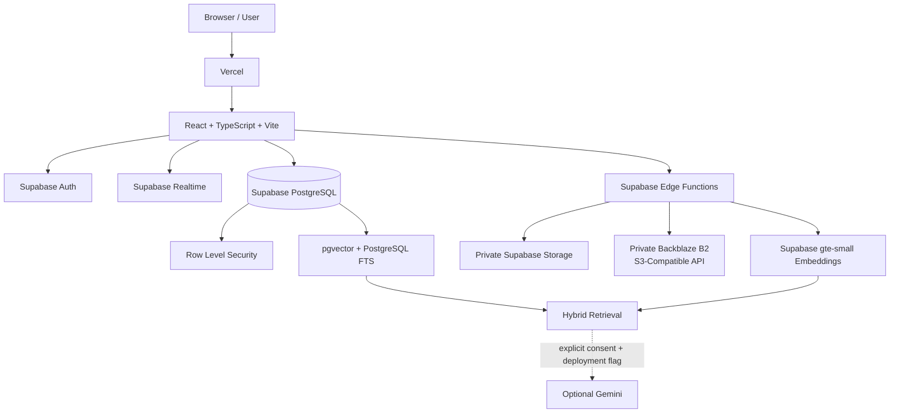

### Hosted Responsibility Split

| Layer | Responsibility |
|---|---|
| Vercel | Frontend hosting and SPA delivery |
| React + TypeScript | Product UI, routing, state, upload orchestration |
| Supabase Auth | Authentication, sessions, password recovery, MFA |
| PostgreSQL | File, folder, version, sharing, activity, AI and configuration metadata |
| Row Level Security | Owner-level authorization below the UI |
| Supabase Realtime | Live synchronization of product state |
| Supabase Storage | Private direct object storage |
| Backblaze B2 | Private S3-compatible large-object storage |
| Supabase Edge Functions | Trusted server-side storage, sharing, search and lifecycle workflows |
| pgvector | Vector similarity retrieval |
| PostgreSQL FTS | Lexical full-text retrieval |
| Supabase AI | `gte-small` embedding generation |
| Gemini | Optional consent-gated grounded generation |

The frontend never receives long-lived Backblaze credentials or Supabase service-role credentials.

Trusted storage and lifecycle operations remain on the server side.

---

## Hosted Request Flow

A typical authenticated CloudVault request follows this model:

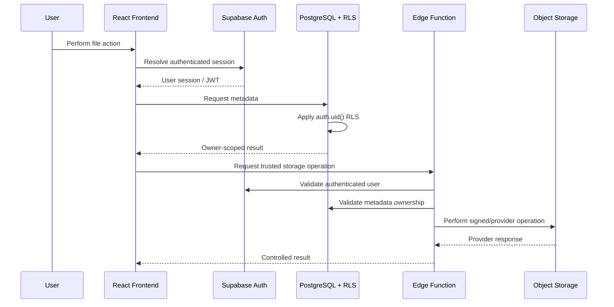

This design ensures that ownership validation is not dependent on frontend state.

---

## Local Distributed-Systems Architecture

CloudVault also includes a local distributed backend profile built around independent infrastructure services.

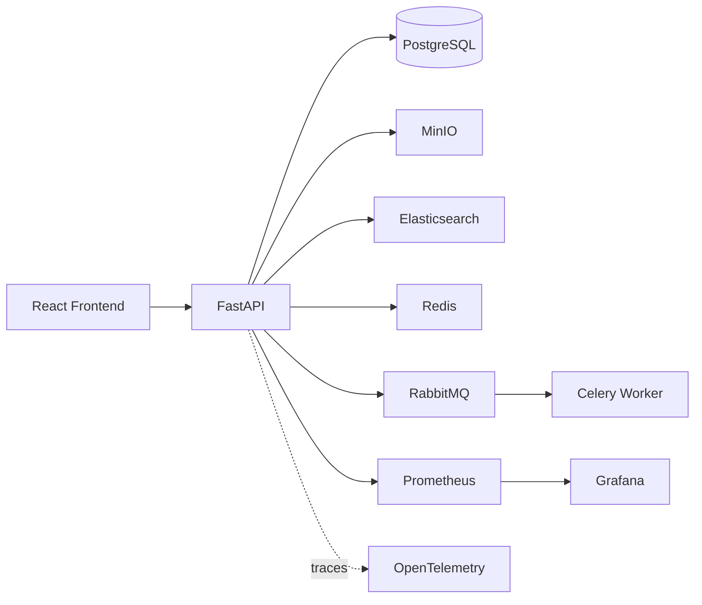

### Local Components

| Component | Role |
|---|---|
| FastAPI | Main Python API layer |
| PostgreSQL | Relational application state |
| MinIO | Local S3-compatible object storage |
| Redis | Caching and supporting distributed state |
| RabbitMQ | Message broker |
| Celery | Background task processing |
| Elasticsearch | Search infrastructure |
| Prometheus | Metrics collection |
| Grafana | Metrics dashboards |
| OpenTelemetry | Vendor-neutral distributed tracing |
| Docker Compose | Service orchestration |

The API container and background worker are intentionally separated so long-running or compute-heavy workflows do not need to execute inside synchronous API requests.

---

## Why Two Architectures?

The two profiles serve different engineering goals.

### Hosted Profile

Optimized for:

- practical deployment
- low operational overhead
- managed authentication
- managed PostgreSQL
- managed Realtime
- private object storage
- serverless workflows
- free-first deployment strategy

### Distributed Profile

Optimized for:

- backend engineering practice
- service orchestration
- queues and workers
- distributed infrastructure
- search services
- monitoring
- tracing
- failure isolation
- local experimentation

This makes CloudVault useful both as a production-style hosted product and as a distributed-systems engineering platform.

---

# Large-File Storage Architecture

Large file handling is one of the central engineering areas of CloudVault.

CloudVault separates:

1. the **product upload policy**
2. the **direct-upload limit**
3. the **large-object provider**

This prevents the product's maximum supported file size from being incorrectly coupled to the limitations of one storage provider.

---

## Upload Policy

Current runtime policy:

| Setting | Current Value |
|---|---:|
| Product upload ceiling | 1.5 GiB per file |
| Supabase direct-upload ceiling | 50 MB |
| Large-object provider | Backblaze B2 |
| Multipart part size | 16 MiB |
| Multipart parallelism | 3 |
| Retry attempts per failed part | 4 |

Files within the direct-upload ceiling can use private Supabase Storage.

Files above that ceiling are routed to the configured large-object provider.

---

## Upload Decision Flow

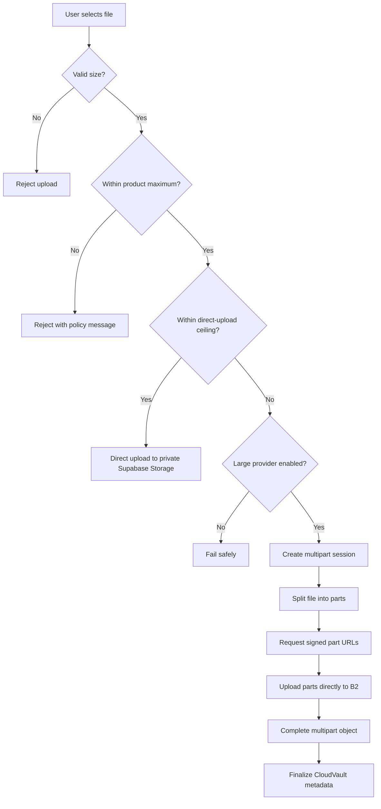

The frontend does not automatically fall back to an unintended provider if large-file storage is unavailable.

The system fails explicitly instead.

---

## Multipart Upload Lifecycle

A large upload moves through several stages:

```text
Preparing
   |
Initiated
   |
Uploading
   |
+---------------------------+
|                           |
Pause                    Part Failure
|                           |
Resume                 Retry + Backoff
|                           |
+-------------+-------------+
              |
         Completing
              |
          Completed
```

CloudVault tracks:

- upload session
- storage provider
- provider upload ID
- object key
- file ID
- destination folder
- file size
- part size
- version number
- replacement relationship
- current upload status

---

## Parallel Multipart Upload

Large files are uploaded using multiple parts.

For example, with a 64 MiB file and a 16 MiB part size:

```text
64 MiB File
   |
   +-- Part 1: 16 MiB
   +-- Part 2: 16 MiB
   +-- Part 3: 16 MiB
   +-- Part 4: 16 MiB
```

The browser can upload multiple parts concurrently according to the configured multipart parallelism.

Current default:

```text
multipart_parallelism = 3
```

This reduces upload time without creating uncontrolled browser concurrency.

---

## Signed Part Uploads

Backblaze application credentials remain only inside trusted Supabase Edge Functions.

The browser never receives them.

Instead:

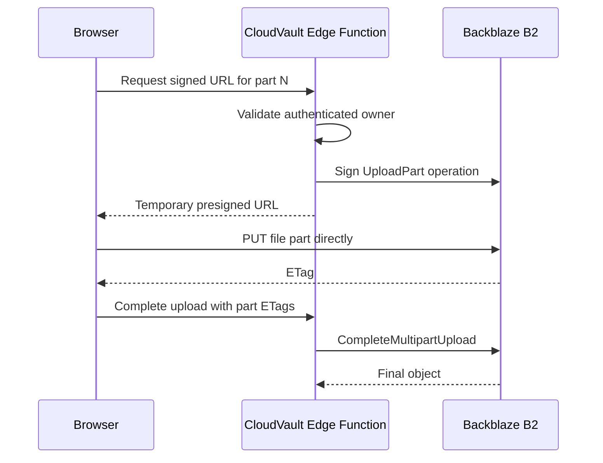

This avoids routing large binary payloads through the Edge Function itself.

---

## Pause and Resume

Multipart uploads support user-controlled pause and resume.

When paused:

- active browser part requests are aborted
- the CloudVault session remains intact
- completed provider parts are preserved
- no completed part needs to be uploaded again

When resumed:

- CloudVault determines which parts are already complete
- only missing parts continue

---

## Retry Strategy

Individual part failures use bounded retry logic with exponential backoff.

This avoids restarting an entire large file because one part encountered a temporary network failure.

Conceptually:

```text
Attempt 1
   |
Failure
   |
Wait
   |
Attempt 2
   |
Failure
   |
Longer wait
   |
Attempt 3
```

Retries remain bounded to avoid infinite request loops.

---

## Browser Refresh Recovery

Large-file recovery is designed around a CloudVault multipart session.

The browser stores only the CloudVault session identifier.

The storage provider remains the source of truth for already uploaded parts.

After a refresh, CloudVault can:

1. recover the session ID
2. request multipart status
3. identify the provider recorded on the session
4. query provider-side uploaded parts
5. mark those parts complete
6. upload only missing parts
7. complete the multipart upload
8. finalize file and version metadata

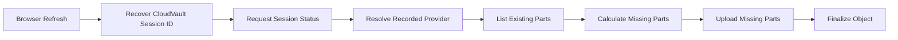

---

## Why the Provider Is Stored Per Session

CloudVault records the provider used by each multipart session.

This matters because runtime product configuration may change while an upload is still in progress.

For example:

```text
Upload begins using B2
        |
Product default changes later
        |
Existing upload must still finish against B2
```

The upload therefore resumes against the provider recorded when the session was created rather than blindly using the latest product default.

---

## Completion Recovery

One difficult storage failure boundary occurs when:

1. the object provider successfully completes the multipart object
2. the browser loses the response
3. PostgreSQL metadata is not yet finalized

CloudVault includes recovery logic for this boundary.

The completion workflow can use provider state to determine whether the object already exists and safely finalize the metadata instead of creating a duplicate upload.

This helps make completion idempotent across network interruptions.

---

## Direct Upload vs Multipart Upload

| Capability | Direct Upload | Multipart Upload |
|---|---|---|
| Current target | Supabase Storage | Backblaze B2 |
| Recommended for | Smaller objects | Large objects |
| Pause/resume | No multipart recovery | Supported |
| Parallel parts | No | Yes |
| Provider part recovery | No | Yes |
| Browser direct-to-provider | Yes | Yes, via presigned URLs |
| Provider recorded in metadata | Yes | Yes |
| Version-aware | Yes | Yes |

---

## Storage Provider Abstraction

CloudVault currently supports provider-aware metadata for:

```text
supabase
b2
r2
```

Backblaze B2 is the primary large-object target.

Cloudflare R2 compatibility remains in the codebase for existing deployments, but CloudVault's current large-object configuration is centered on B2.

Provider-aware metadata allows downloads, versions, replacements, shares, and permanent purge operations to resolve the correct object store.

---

## Private Backblaze B2 Design

The B2 bucket remains private.

CloudVault does not expose public bucket objects.

Configured protections include:

- private bucket
- bucket-scoped application credentials
- server-side secret storage
- signed multipart URLs
- signed downloads
- controlled CORS
- explicit provider enablement
- object lifecycle through trusted Edge Functions

Browser CORS is configured to expose the `ETag` response header because multipart completion requires the ETag returned for each uploaded part.

---

## Large-File Validation Philosophy

CloudVault distinguishes between:

```text
Architecture implemented
        !=
Production behavior fully verified
```

The application is configured around a 1.5 GiB product upload policy, but the project does not claim that the full 1.5 GiB workflow is production-verified until the real end-to-end validation passes.

The complete validation includes:

- file larger than the direct-upload threshold
- multipart initiation
- part upload
- pause
- resume
- browser-refresh recovery
- finalization
- signed download
- sharing
- file replacement
- historical version download
- version restore
- Trash and restore
- permanent provider purge
- final full-size 1.5 GiB upload test

This validation-first approach keeps CloudVault's documentation aligned with actual measured behavior.
---

# Security Architecture

Security in CloudVault is enforced below the frontend.

The React application is treated as the user interface, not the authorization boundary.

CloudVault relies on:

- authenticated Supabase sessions
- PostgreSQL Row Level Security
- owner-scoped database operations
- private object storage
- server-side provider credentials
- trusted Edge Functions
- signed URLs
- hashed share tokens
- explicit external-AI consent
- provider-aware destructive operations

This creates multiple independent security layers instead of depending on client-side checks.

---

## Identity and Session Security

CloudVault uses Supabase Auth for identity management.

Implemented account workflows include:

- registration
- email/password sign-in
- session management
- password recovery
- secure password reset
- MFA enrollment
- MFA challenge
- authenticator factor management
- AAL2 protection for sensitive workspace access

The frontend can react to session state, but ownership enforcement remains in PostgreSQL and trusted server-side functions.

---

## Row Level Security

Private product tables use PostgreSQL Row Level Security.

The core ownership rule is based on:

```sql
auth.uid()
```

Conceptually:

```sql
using ((select auth.uid()) = owner_id)
```

This means a user cannot access another user's data simply by modifying a request in the browser.

---

## Owner-Scoped Resources

RLS protects resources such as:

- `vault_files`
- `vault_folders`
- `file_versions`
- `file_chunks`
- `multipart_uploads`
- `share_links`
- `activity_events`
- `ai_query_events`
- `user_preferences`

The product-settings table is intentionally handled differently because it stores shared deployment configuration rather than user-owned private data.

---

## Why RLS Matters

Without RLS, a frontend bug or manipulated request could potentially ask PostgreSQL for data belonging to another account.

With owner-scoped RLS:

```text
Browser Request
      |
Authenticated JWT
      |
PostgreSQL
      |
RLS Policy
      |
auth.uid() == owner_id ?
      |
   +-- Yes -> allowed
   |
   +-- No  -> rejected
```

The privacy boundary therefore remains active even if the UI layer is bypassed.

---

## Storage Isolation

CloudVault keeps object storage private.

### Supabase Storage

Object paths are scoped by user ownership.

A user can access only objects belonging to their own storage path.

### Backblaze B2

Backblaze credentials remain server-side.

The browser receives only short-lived presigned URLs for specific operations.

The frontend never receives:

- B2 application secrets
- service-role credentials
- long-lived provider tokens

---

# Secure Sharing

CloudVault supports public sharing without making the underlying storage bucket public.

A share link grants access only to the specific file represented by that link.

---

## Share-Link Flow

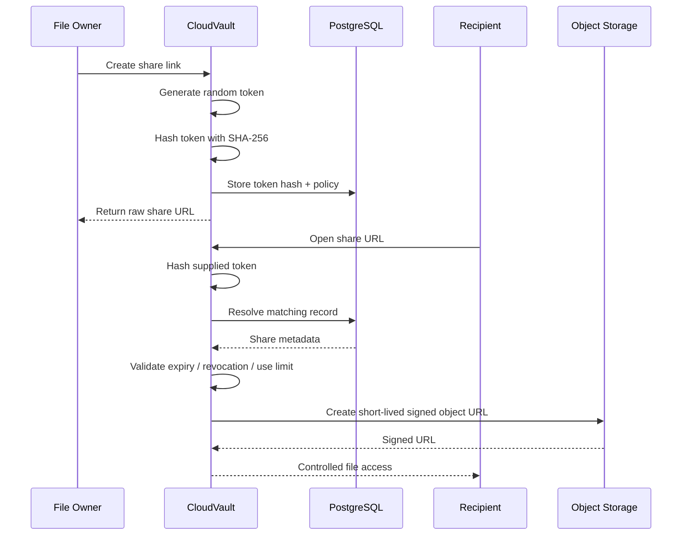

---

## Raw Share Tokens Are Not Stored

The original share token is returned only when the share URL is created.

CloudVault stores:

```text
SHA-256(token)
```

rather than:

```text
raw token
```

This reduces the impact of database exposure because the original access token is not persisted.

---

## Share Controls

A share link can support:

- expiration
- maximum usage count
- revocation
- live usage count
- provider-aware object resolution

This gives the owner control over both time and consumption.

---

## Atomic Share Consumption

Usage-limited share links need protection against concurrent requests.

CloudVault handles share consumption as an atomic operation so multiple simultaneous requests cannot independently pass the same stale usage count.

Conceptually:

```text
Read usage count
      |
Validate policy
      |
Increment use
      |
Return result
```

must behave as one controlled transaction rather than separate uncoordinated browser operations.

---

# File Lifecycle Management

CloudVault separates logical file lifecycle from physical object storage.

A file can move through states such as:

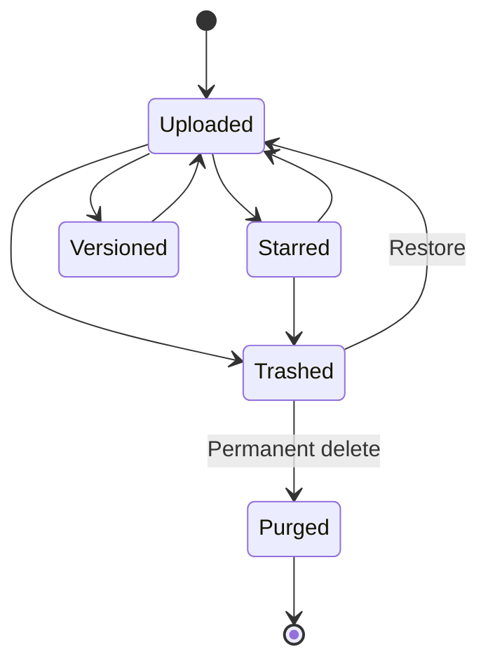

---

## Soft Delete

Moving a file to Trash does not immediately destroy the underlying data.

The file first enters a recoverable deleted state.

This supports:

- user recovery
- safer destructive operations
- separate permanent purge logic

---

## Permanent Purge

Permanent deletion is provider-aware.

CloudVault must remove:

- current provider object
- historical provider-backed versions
- associated metadata
- relevant search/index records
- lifecycle references

This prevents orphaned objects from remaining in external storage after metadata deletion.

---

# Recoverable Folder Lifecycle

Folder deletion is more complex than file deletion.

A folder can contain:

- child folders
- files
- nested descendants
- independently deleted files
- provider-backed objects

CloudVault therefore treats folder Trash as a hierarchy operation.

---

## Folder Trash Flow

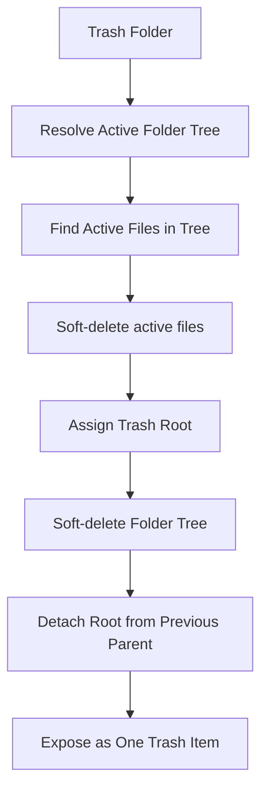

The entire active hierarchy is grouped under one Trash root.

---

## Restore Flow

When restoring a folder hierarchy, CloudVault attempts to return it to its former parent.

If the previous parent is unavailable, the hierarchy can be restored safely to an appropriate fallback location.

Conceptually:

```text
Restore Trash Root
       |
Previous parent still valid?
       |
   +---+---+
   |       |
  Yes      No
   |       |
Restore   Restore safely
under     without invalid
parent    hierarchy link
```

---

## Why Folder Operations Use Database RPCs

Recursive hierarchy changes involve multiple related rows.

Using controlled PostgreSQL functions allows the operation to be handled transactionally rather than issuing many disconnected browser updates.

This protects against partial states such as:

- folder marked deleted but child files still active
- descendants restored without the root
- activity event written while hierarchy update failed
- parent references becoming inconsistent

---

# File Versioning

CloudVault uses immutable file version history.

Replacing a file does not destroy the previous version.

Instead, the current version and historical versions remain separately represented.

---

## Version Model

A file can conceptually look like this:

```text
report.pdf
|
+-- v1  Supabase
|
+-- v2  Backblaze B2
|
+-- v3  Backblaze B2   <- current
```

Historical versions retain provider-aware metadata.

This matters because a file's versions do not necessarily live in the same object store.

---

## Provider-Aware Versioning

Each version records enough storage information to locate its own object.

This allows CloudVault to correctly handle:

- current Supabase file with older B2 version
- current B2 file with older Supabase version
- provider changes over time
- historical signed downloads
- restore of an older version

The current global storage provider does not overwrite historical provider identity.

---

## Restoring an Older Version

Restoring a historical version does not mutate that historical record.

Instead, CloudVault restores it as a **new current version**.

Example:

```text
v1
v2
v3 current

Restore v1
      |
      v

v1
v2
v3
v4 current  <- content restored from v1
```

This preserves a complete audit-friendly version timeline.

---

# Activity Audit Trail

CloudVault records meaningful user actions through an activity-event model.

Examples include:

- file upload
- file deletion
- folder deletion
- restoration
- share-link actions
- version-related operations

Activity records are owner-scoped.

The browser is not given unrestricted ability to insert arbitrary audit history.

Trusted workflows create activity records as part of controlled transactions.

---

# CloudVault Intelligence

CloudVault Intelligence is retrieval-first.

It is not designed as a generic chatbot attached to a storage interface.

Its goal is to help a user understand and discover information inside their own files while preserving the same ownership boundary as the rest of CloudVault.

---

## Retrieval Pipeline

CloudVault combines:

- semantic embeddings
- vector similarity
- lexical full-text search
- weighted hybrid ranking
- owner-aware filtering
- file-level deduplication

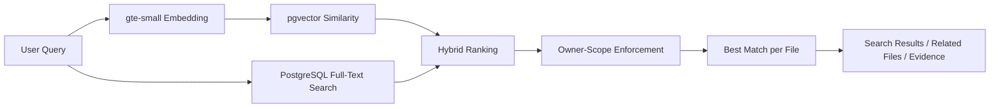

---

## Semantic Retrieval

Semantic retrieval converts the query into an embedding using:

```text
gte-small
```

The vector is compared against indexed file chunks using pgvector similarity.

This enables meaning-based search rather than exact text matching only.

---

## Lexical Retrieval

PostgreSQL full-text search handles exact and term-oriented relevance.

This is valuable for:

- exact names
- technical keywords
- identifiers
- phrases
- terminology that semantic search may generalize too aggressively

---

## Hybrid Ranking

CloudVault combines semantic and lexical signals.

Conceptually:

```text
Final Score =
    semantic_weight × semantic_score
    +
    lexical_weight × lexical_score
```

The weights are configurable through product settings.

This provides a balance between meaning-based retrieval and precise textual relevance.

---

## Permission-Aware Search

Search results are not retrieved globally and filtered only in React.

Ownership enforcement happens inside the data layer.

The retrieval boundary remains tied to the authenticated user.

This prevents semantic search from becoming a path around standard file authorization.

---

## File-Level Deduplication

Chunk-based retrieval can return multiple matching chunks from the same file.

CloudVault keeps the strongest relevant result per file when presenting file-level search results.

This avoids flooding the user with repeated entries from the same document.

---

# Related-File Intelligence

The same embedding infrastructure can be used to discover files related by semantic content.

For example:

```text
Current Document
       |
Embedding
       |
Similarity Search
       |
Related Files
```

This allows CloudVault Intelligence to surface relationships that folder structure alone may not reveal.

---

# Grounded Evidence Retrieval

CloudVault can retrieve private evidence related to a user question.

The retrieval process remains useful even if generative AI is disabled.

In retrieval-only mode, CloudVault can return:

- matching files
- relevant chunks
- semantic score
- lexical score
- combined score
- grounded evidence

This means core intelligence does not depend on an external LLM.

---

# Optional Grounded Generation

CloudVault supports an optional Gemini-backed answer layer.

The model is not allowed to answer freely from general knowledge in this workflow.

The prompt instructs it to answer only from retrieved private evidence.

Conceptually:

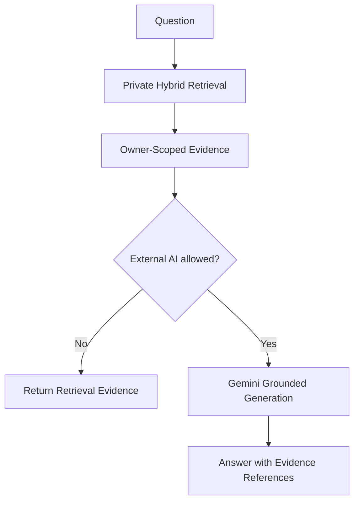

---

## External AI Consent Model

Private evidence is sent to Gemini only when **all** required conditions are satisfied.

### Condition 1

Deployment configuration must allow generative AI:

```text
generative_ai_enabled = true
```

### Condition 2

A server-side provider key must exist:

```text
GEMINI_API_KEY
```

### Condition 3

The authenticated user must explicitly enable:

```text
allow_external_ai = true
```

If any condition is missing, CloudVault remains in retrieval-only mode.

---

## Why This Boundary Matters

Cloud storage contains private data.

The existence of an AI feature should not automatically mean that private evidence is transmitted to an external provider.

CloudVault therefore distinguishes:

```text
Private retrieval
        |
        +---- works without external AI
        |
Optional generation
        |
        +---- requires deployment enablement
        +---- requires provider credentials
        +---- requires explicit user consent
```

---

## Grounding Rules

The grounded-answer workflow instructs the model to:

- answer only from supplied evidence
- avoid outside knowledge
- state when evidence is insufficient
- reference retrieved evidence
- avoid inventing filenames
- avoid inventing people
- avoid inventing metrics
- avoid inventing facts

This reduces the risk of turning storage search into unconstrained generation.

---

# AI Observability

CloudVault records limited AI request telemetry for engineering visibility.

Tracked metadata can include:

- request type
- provider
- result count
- duration
- status

Raw search queries are not stored in the AI telemetry table.

This preserves useful operational information without unnecessarily collecting the user's private query text.

---

# Retrieval Evaluation

The repository includes tooling for retrieval evaluation.

Supported metrics include:

- Precision@K
- Recall@K
- Mean Reciprocal Rank
- nDCG@K

These tools are intended for use with:

- a representative document corpus
- real indexed chunks
- human-labelled relevance judgments

CloudVault does not publish retrieval scores until such a dataset exists.

---

# Account Security

CloudVault includes several layers of account protection.

Implemented:

- email/password authentication
- password reset
- stronger password requirements for new registrations and resets
- TOTP MFA enrollment
- authenticator QR configuration
- factor management
- AAL2 workspace gating

Feature-gated:

- WebAuthn/passkeys

Passkey code remains disabled until hosted Supabase passkey configuration is verified for the final production domain.

---

# Security Principles Used in CloudVault

The project follows several security rules:

1. Authentication alone is not authorization.
2. Ownership checks must exist in the database layer.
3. Storage buckets remain private.
4. Long-lived storage credentials never belong in browser code.
5. Public sharing exposes one file, not an entire bucket.
6. Raw share tokens are not stored.
7. Destructive operations must understand the underlying storage provider.
8. External AI access must require explicit consent.
9. Secrets remain outside Git.
10. Browser-visible Supabase credentials must be publishable credentials only.
11. Service-role access is restricted to trusted server-side workflows where actually required.
12. Missing provider metadata should fail closed rather than silently fall back to another provider.

---

# Privacy by Design

CloudVault aims to preserve the same privacy model across:

- file browsing
- folder navigation
- version history
- sharing
- search
- related-file retrieval
- grounded evidence
- multipart uploads
- permanent purge

Adding a new feature should not create a weaker authorization path than the rest of the system.

That principle is especially important for search and AI workflows, where data-access rules can otherwise be unintentionally bypassed.
---

# Technology Stack

CloudVault combines frontend engineering, backend development, cloud infrastructure, distributed systems, database security, object storage, retrieval systems, AI integration, observability, and DevOps.

The stack is intentionally divided by responsibility rather than treated as one large application layer.

---

## Frontend Technologies

| Technology | Role in CloudVault |
|---|---|
| React 19 | Component-based user interface |
| TypeScript | Type-safe frontend development |
| Vite | Development server and production bundling |
| React Router | Multipage SPA routing |
| Tailwind CSS 4 | Styling pipeline |
| Lucide React | Interface icon system |
| Supabase JavaScript SDK | Auth, database, Realtime, Storage and Edge Function communication |
| Playwright | Responsive browser quality assurance |

### Frontend Engineering Areas

The frontend includes work around:

- component architecture
- authenticated routing
- protected workspace flows
- realtime state refresh
- file and folder interaction
- large-file upload orchestration
- multipart upload progress
- pause and resume controls
- responsive layouts
- theme management
- route-level lazy loading
- error handling
- storage-provider-aware UI behavior
- accessibility-oriented interaction
- mobile and tablet responsiveness

---

# Backend Technologies

CloudVault's local distributed backend is implemented with Python and FastAPI.

| Technology | Role |
|---|---|
| Python 3.12 | Backend runtime |
| FastAPI | REST API framework |
| Uvicorn | ASGI application server |
| SQLAlchemy | Database access and ORM |
| Alembic | Database migrations |
| Psycopg | PostgreSQL driver |
| Pydantic Settings | Environment and application configuration |
| PyJWT | JWT handling |
| pwdlib + Argon2 | Password hashing support |
| HTTPX | Async HTTP communication |
| python-multipart | Multipart request handling |
| PyPDF | PDF processing support |
| python-docx | DOCX processing support |

The backend is designed around explicit service boundaries rather than placing all infrastructure logic inside API route handlers.

---

# Database Technologies

## PostgreSQL

PostgreSQL is used as CloudVault's core relational datastore.

It stores:

- users' file metadata
- folder hierarchy
- file versions
- multipart sessions
- activity history
- share-link records
- AI retrieval metadata
- product configuration
- user preferences
- semantic chunks

CloudVault uses PostgreSQL for more than CRUD operations.

Engineering areas include:

- relational schema design
- foreign keys
- check constraints
- indexes
- transactional operations
- recursive folder workflows
- Row Level Security
- full-text search
- vector search
- configuration storage
- audit-oriented lifecycle events

---

## PostgreSQL Row Level Security

RLS provides database-level authorization.

This is one of the central technologies in the hosted CloudVault security model.

Instead of relying only on frontend filters such as:

```text
WHERE owner_id = current_user
```

CloudVault uses database policies tied to the authenticated Supabase identity.

This ensures ownership rules remain active regardless of how a request reaches PostgreSQL.

---

## pgvector

CloudVault uses pgvector for semantic similarity retrieval.

Embeddings generated from file chunks are stored alongside relational metadata.

This allows semantic search to remain close to the application's authorization model rather than introducing a completely separate vector database with another permission layer.

---

## PostgreSQL Full-Text Search

Lexical retrieval uses PostgreSQL full-text search.

Combining PostgreSQL FTS with pgvector allows CloudVault to implement hybrid search without requiring an additional hosted retrieval platform.

---

# Supabase

Supabase acts as the primary hosted backend platform.

CloudVault uses several Supabase capabilities independently.

| Supabase Capability | CloudVault Usage |
|---|---|
| Auth | Registration, login, sessions, recovery and MFA |
| PostgreSQL | Application data and transactions |
| Row Level Security | Owner-scoped authorization |
| Realtime | Live file, folder, activity and settings updates |
| Storage | Private direct object storage |
| Edge Functions | Trusted server-side workflows |
| pgvector | Semantic vector retrieval |
| Supabase AI | `gte-small` embedding generation |

---

# Supabase Edge Functions

Trusted operations that should not execute directly in browser code are implemented using Supabase Edge Functions.

CloudVault Edge Functions include workflows for:

- multipart uploads
- signed object URLs
- file purge
- folder purge
- version restoration
- semantic search
- grounded answers
- share-link resolution
- file indexing

Deno is used as the Edge Function runtime.

These functions form an important security boundary between browser clients and privileged provider operations.

---

# Object Storage

CloudVault uses multiple storage technologies depending on the runtime profile.

---

## Supabase Storage

Used for private direct uploads in the hosted profile.

Primary responsibilities:

- smaller objects
- authenticated private storage
- signed downloads
- user-scoped object paths

---

## Backblaze B2

Backblaze B2 is the primary large-object provider.

It is integrated through its S3-compatible API.

CloudVault uses B2 concepts such as:

- private buckets
- application keys
- S3 endpoints
- multipart uploads
- UploadPart
- ListParts
- CompleteMultipartUpload
- AbortMultipartUpload
- signed URLs
- CORS
- object deletion

Provider credentials remain server-side.

---

## MinIO

MinIO is used in the local distributed profile.

It provides an S3-compatible local object-storage system and allows storage workflows to be developed without relying on an external provider.

---

# Distributed Systems Technologies

CloudVault's local stack includes multiple infrastructure services.

---

## RabbitMQ

RabbitMQ acts as the message broker.

It supports asynchronous communication between API workflows and background workers.

This allows work to be moved outside the synchronous request path.

---

## Celery

Celery provides background job processing.

This architecture is useful for tasks that are:

- asynchronous
- expensive
- retryable
- unsuitable for blocking an API request

The worker runs separately from the normal FastAPI application.

---

## Redis

Redis is included as part of the local distributed environment for fast state access and supporting distributed workflows.

---

## Elasticsearch

Elasticsearch is included in the local architecture as a dedicated search infrastructure component.

The hosted CloudVault product currently relies primarily on PostgreSQL FTS and pgvector, while Elasticsearch remains useful for distributed-system experimentation and local search architecture.

---

# AI and Retrieval Technologies

CloudVault uses AI only where it has a clear storage or retrieval use case.

It is not implemented as a generic chatbot layer.

---

## Supabase `gte-small`

`gte-small` is used to generate embeddings for:

- file chunks
- semantic queries

These vectors allow CloudVault to perform meaning-based similarity search.

---

## Hybrid Retrieval

Hybrid retrieval combines:

```text
Semantic Similarity
        +
Lexical Relevance
        =
Hybrid Result Ranking
```

Technologies involved:

- Supabase AI
- pgvector
- PostgreSQL FTS
- PostgreSQL RPC functions
- configurable ranking weights

---

## Gemini

Gemini is an optional external generation provider.

Its role is limited to grounded answer generation using previously retrieved evidence.

Gemini is not required for:

- storage
- authentication
- file uploads
- semantic retrieval
- related-file search
- evidence retrieval

External generation remains feature-gated and consent-gated.

---

# DevOps and Deployment

CloudVault uses several DevOps technologies to maintain consistent development and deployment workflows.

---

## Docker

Docker is used to create reproducible images for:

- FastAPI backend
- frontend application
- worker runtime

This reduces environment differences between development and automated CI.

---

## Docker Compose

Docker Compose orchestrates the local distributed profile.

Services include:

```text
PostgreSQL
Redis
RabbitMQ
MinIO
Elasticsearch
FastAPI
Celery Worker
React Frontend
Prometheus
Grafana
```

This provides a realistic multi-service development environment.

---

## GitHub Actions

GitHub Actions runs CloudVault's automated quality gates.

The pipeline validates:

- backend linting
- backend formatting
- backend tests
- Python compilation
- frontend dependency security
- TypeScript compilation
- frontend production build
- responsive browser QA
- Docker image builds
- Edge Function typechecking
- tested frontend artifacts

CI is used throughout development rather than only before final deployment.

---

## Vercel

Vercel hosts the production frontend.

CloudVault uses Vite production builds with SPA rewrites so application routes resolve correctly.

---

# Testing Technologies

## Pytest

Backend tests are written and executed with Pytest.

The CI pipeline also collects code coverage output.

---

## Ruff

Ruff is used for:

- Python linting
- formatting validation
- import checks
- code-quality rules

---

## Playwright

Playwright provides responsive browser validation.

The tests run against:

- Chromium
- WebKit

and cover multiple phone, tablet, and desktop viewport classes.

---

## npm Audit

Frontend dependencies are checked for high-severity vulnerabilities as part of CI.

---

## Deno Check

Production Supabase Edge Functions are statically validated with:

```text
deno check
```

before changes are considered ready.

---

# Observability Stack

CloudVault includes observability for both hosted and local profiles.

---

## Prometheus

Prometheus collects application metrics from the local FastAPI environment.

---

## Grafana

Grafana provides visualization of Prometheus metrics.

---

## OpenTelemetry

OpenTelemetry is used for vendor-neutral tracing support.

The backend includes:

- trace IDs
- span IDs
- request correlation
- optional OTLP HTTP export

This avoids tying the project to one monitoring vendor.

---

# Skills Demonstrated

CloudVault is intended to demonstrate engineering depth across several domains.

---

## Full-Stack Development

Skills demonstrated:

- React application development
- TypeScript
- frontend architecture
- backend API development
- authentication integration
- routing
- realtime UI state
- file-management workflows
- responsive interfaces
- error-state design
- asynchronous browser operations

---

## Backend Engineering

Skills demonstrated:

- Python
- FastAPI
- REST API design
- SQLAlchemy
- database migrations
- application configuration
- service-layer architecture
- background processing
- authentication and authorization
- error handling
- API observability

---

## Database Engineering

Skills demonstrated:

- PostgreSQL
- relational schema design
- primary and foreign keys
- database constraints
- indexes
- Row Level Security
- recursive hierarchy operations
- transactional database functions
- full-text search
- pgvector
- audit-event architecture
- production query inspection
- database security hardening

---

## Cloud Engineering

Skills demonstrated:

- Supabase
- Vercel
- Backblaze B2
- managed PostgreSQL
- managed authentication
- serverless Edge Functions
- object-storage integration
- cloud secret management
- CORS configuration
- signed URLs
- environment configuration

---

## Object Storage Engineering

Skills demonstrated:

- S3-compatible APIs
- private buckets
- multipart uploads
- presigned URLs
- ETags
- part completion
- upload abort
- recovery
- provider abstraction
- provider-aware deletion
- signed downloads
- storage lifecycle management

---

## Distributed Systems

Skills demonstrated:

- asynchronous architecture
- service decomposition
- message brokers
- worker processes
- background jobs
- cache infrastructure
- distributed search
- object storage
- service dependencies
- Docker Compose orchestration

Technologies include:

- RabbitMQ
- Celery
- Redis
- MinIO
- Elasticsearch
- PostgreSQL

---

## System Design

CloudVault demonstrates system-design concepts such as:

- separation of control plane and object-storage path
- provider abstraction
- recoverable multipart uploads
- immutable version history
- distributed service architecture
- least-privilege access
- server-side trust boundaries
- soft-delete and permanent-purge design
- secure public sharing
- runtime feature configuration
- failure recovery
- idempotent completion
- provider-specific lifecycle management

---

## Security Engineering

Skills demonstrated:

- authentication
- authorization
- PostgreSQL RLS
- MFA
- AAL2
- private storage
- secret management
- token hashing
- least-privilege provider credentials
- trusted Edge Functions
- signed URLs
- fail-closed provider handling
- explicit privacy boundaries

---

## AI and Data Engineering

Skills demonstrated:

- document chunking
- embeddings
- vector storage
- pgvector
- semantic similarity
- lexical search
- hybrid ranking
- retrieval pipelines
- related-document discovery
- grounded generation
- retrieval evaluation
- permission-aware AI
- consent-based external AI integration

---

## DevOps Engineering

Skills demonstrated:

- Docker
- Docker Compose
- GitHub Actions
- CI pipelines
- environment management
- secrets management
- automated testing
- production builds
- Docker image validation
- artifact publishing
- deployment workflows

---

## Testing and Quality Engineering

Skills demonstrated:

- backend unit/integration testing
- linting
- formatting enforcement
- dependency security auditing
- TypeScript compile checks
- Edge Function static checks
- browser automation
- responsive QA
- cross-browser validation
- quality gates before merge
- regression-focused development

---

## Observability Engineering

Skills demonstrated:

- Prometheus
- Grafana
- OpenTelemetry
- structured logging
- request correlation
- tracing
- operational telemetry
- AI request duration tracking
- provider-aware diagnostics

---

# Engineering Practices Applied

CloudVault development follows several professional engineering practices.

### Incremental Changes

Features and fixes are implemented in small, reviewable changes rather than large uncontrolled rewrites.

### Quality Gates

Changes are validated through automated CI before being treated as production-ready.

### Failure Analysis

Bugs are traced to their actual system boundary rather than patched only at the UI level.

Examples include:

- RLS transaction failures
- multipart provider errors
- storage metadata drift
- provider fallback behavior
- deployment-origin CORS issues

### Least Privilege

Credentials and database access are intentionally scoped to the minimum required authority.

### Server-Side Trust

Provider credentials and privileged actions remain in trusted server-side components.

### Explicit Configuration

Product behavior is stored in runtime configuration rather than duplicated across frontend components.

### Evidence-Based Claims

Performance and reliability claims are recorded only when measured.

---

# Engineering Breadth

CloudVault brings together several areas that are often built as separate projects:

```text
Frontend Engineering
        +
Backend Development
        +
Database Security
        +
Cloud Storage
        +
Distributed Systems
        +
DevOps
        +
Observability
        +
AI Retrieval
        +
Testing
        =
CloudVault
```

The result is intended to demonstrate how these areas interact inside one coherent product rather than as isolated technology demos.
---

# Performance Engineering

CloudVault includes frontend and backend performance work that is measured rather than assumed.

The project separates:

- build-size optimization
- browser responsiveness
- database execution time
- end-to-end latency
- scalability

These measurements are intentionally not mixed together.

---

## Route-Level Code Splitting

The frontend originally loaded most route code eagerly.

CloudVault was later hardened using route-level lazy loading with React `lazy` and `Suspense`.

This allows page-specific code to load only when the user navigates to that route.

### Measured Build Evidence

| Build State | Shared JavaScript | Shared gzip |
|---|---:|---:|
| Before route splitting | 530.29 kB | 150.22 kB |
| After route splitting | 445.34 kB | 130.04 kB |

Measured improvement:

- approximately **16% reduction** in shared minified JavaScript
- approximately **13% reduction** in shared gzip JavaScript

Representative deferred page chunks include:

- Vault
- Settings
- Intelligence
- Dashboard
- Authentication pages

These values are production build-artifact measurements.

They are **not** presented as browser network-latency or Core Web Vitals measurements.

---

## Why Route Splitting Matters

Without route splitting:

```text
Initial Page Load
      |
Load all route code
      |
User may never visit most pages
```

With route splitting:

```text
Initial Page Load
      |
Load shared application code
      |
User navigates to Vault
      |
Load Vault page chunk
      |
User navigates to Settings
      |
Load Settings chunk
```

This reduces unnecessary initial JavaScript work while preserving the same application architecture.

---

# Responsive Engineering

CloudVault is designed for desktop, tablet, and mobile use.

Responsive support is validated through automated browser tests rather than only manual resizing.

---

## Responsive Test Matrix

Representative viewport classes include:

| Viewport | Target Class |
|---|---|
| 320 × 568 | Small phone |
| 360 × 800 | Android-class phone |
| 390 × 844 | Modern phone |
| 430 × 932 | Large phone |
| 768 × 1024 | Tablet |
| 820 × 1180 | Large tablet |
| 1024 × 768 | Compact desktop/tablet landscape |

The suite runs using:

- Chromium
- WebKit

---

## Responsive QA Coverage

The automated suite checks areas such as:

- horizontal overflow
- workspace navigation
- mobile navigation behavior
- visible route links
- sign-out accessibility
- folder Trash controls
- file action controls
- touch-target sizing
- input sizing
- mobile layout stability

The route-split production build passed:

```text
28 / 28 responsive browser checks
```

This is automated browser QA, not a claim that every device in existence has been tested.

---

# Continuous Integration

CloudVault uses GitHub Actions as a mandatory quality gate.

Every push and pull request is validated through independent backend, frontend, and Edge Function jobs.

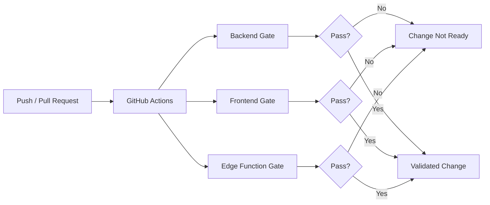

---

# Backend CI Gate

The backend workflow uses Python 3.12.

Validation includes:

```text
Install dependencies
        |
Ruff lint
        |
Ruff formatting check
        |
Pytest
        |
Coverage collection
        |
Python compile checks
        |
Evaluation/load-test syntax validation
        |
Backend Docker image build
```

---

## Backend Linting

CloudVault uses Ruff to enforce Python quality rules.

Configured areas include:

- standard Python errors
- import ordering
- modernization rules
- bug-risk patterns

Formatting is also validated separately.

This prevents lint and formatting differences from becoming hidden technical debt.

---

## Backend Tests

Backend tests run with:

```text
pytest
```

CI also collects code coverage output.

The project does not advertise a made-up coverage percentage.

Coverage output is used as engineering feedback rather than marketing.

---

## Python Compile Validation

The pipeline compiles:

- backend application code
- retrieval evaluation tooling
- load-test scripts

This catches syntax-level issues even in engineering utilities that may not run during normal backend tests.

---

# Frontend CI Gate

Frontend validation includes:

```text
Install dependencies
        |
npm security audit
        |
TypeScript compilation
        |
Vite production build
        |
Install Chromium + WebKit
        |
Responsive Playwright QA
        |
Publish tested frontend artifact
        |
Build frontend Docker image
```

---

## Dependency Security Audit

The frontend pipeline runs:

```bash
npm audit --audit-level=high
```

High-severity dependency vulnerabilities therefore fail the quality gate rather than being silently ignored.

---

## TypeScript and Production Build

The production build runs:

```bash
tsc -b
vite build
```

This validates both:

- TypeScript correctness
- production bundling

A development server successfully starting is not treated as sufficient evidence that the application is production-buildable.

---

# Tested Frontend Artifacts

After browser QA succeeds, GitHub Actions publishes the tested `dist` bundle as a workflow artifact.

This creates a direct connection between:

```text
Code
  |
Production Build
  |
Browser QA
  |
Validated Artifact
```

rather than treating an untested local build as equivalent to the CI-tested output.

---

# Edge Function CI Gate

CloudVault production Edge Functions are statically validated using Deno.

The CI workflow typechecks functions including:

- multipart upload
- object URL generation
- file purge
- folder purge
- version restoration
- semantic search
- grounded answers
- share-link resolution

This catches Edge-runtime and TypeScript issues before deployment.

---

# Docker Validation

CloudVault builds both frontend and backend Docker images in CI.

This verifies that:

- Dockerfiles remain valid
- dependency installation succeeds
- production build steps remain reproducible
- container packaging has not drifted from source code

---

# Quality Gate Philosophy

CloudVault treats testing as part of implementation.

A change is not considered complete simply because:

```text
"It works on my machine"
```

The intended workflow is closer to:

```text
Implement
   |
Local reasoning / validation
   |
Push isolated change
   |
CI
   |
Browser QA
   |
Review
   |
Merge
   |
Production verification
```

This reduces the chance of fixing one area while silently breaking another.

---

# Observability

CloudVault includes observability in both hosted and local profiles.

The goal is to make failures diagnosable rather than returning unexplained errors.

---

## Hosted Observability

Hosted workflows include structured information for operations such as:

- semantic search
- grounded answers
- provider interactions
- multipart uploads

AI request telemetry can record:

- request kind
- provider
- result count
- duration
- status

Raw search query text is intentionally not stored in `ai_query_events`.

---

## Request Identifiers

Trusted functions can use request identifiers so a specific client failure can be correlated with server-side events.

Conceptually:

```text
Browser Error
     |
Request ID
     |
Edge Function Event
     |
Provider / Database Operation
```

This is preferable to exposing provider secrets or internal stack traces directly to the user.

---

# Local Observability

The FastAPI profile includes:

- Prometheus
- Grafana
- OpenTelemetry
- structured request logs
- request correlation IDs
- trace IDs
- span IDs
- optional OTLP export

---

## Prometheus

Prometheus collects runtime metrics from the local backend environment.

This enables metrics-based inspection without requiring a commercial monitoring provider.

---

## Grafana

Grafana provides dashboards over the Prometheus metrics.

It can be used for:

- request behavior
- service state
- application metrics
- operational investigation

---

## OpenTelemetry

CloudVault uses the OpenTelemetry API and SDK for vendor-neutral tracing.

An optional OTLP HTTP exporter can send telemetry to another compatible system without changing the application instrumentation model.

---

# Error Diagnostics

CloudVault has been hardened to avoid hiding useful provider errors.

For example, failed Edge Function calls can surface sanitized provider or configuration errors rather than only returning a generic:

```text
Edge Function returned a non-2xx status code
```

The diagnostic layer is designed to improve troubleshooting without exposing credentials.

---

# Retrieval Evaluation

The repository includes:

```text
evaluation/retrieval/evaluate.py
```

This tooling supports standard information-retrieval metrics.

---

## Precision@K

Precision@K measures how many of the top K retrieved results are relevant.

```text
Precision@K =
Relevant results in top K
-------------------------
             K
```

---

## Recall@K

Recall@K measures how many known relevant results appear in the top K.

```text
Recall@K =
Relevant results found in top K
-------------------------------
Total known relevant results
```

---

## Mean Reciprocal Rank

MRR gives more weight to systems that return the first relevant result earlier.

```text
MRR = mean(1 / rank of first relevant result)
```

---

## nDCG@K

nDCG considers both:

- relevance
- result ordering

It is useful when some documents are more relevant than others.

---

## Why Scores Are Not Invented

Meaningful retrieval evaluation requires:

- representative documents
- indexed chunks
- realistic user queries
- human-labelled relevance judgments

Publishing scores without those inputs would create misleading evidence.

CloudVault keeps the tooling ready while avoiding fabricated accuracy claims.

---

# Load Testing

The repository includes:

```text
loadtests/locustfile.py
```

The load-testing profile can exercise workloads such as:

- hybrid search
- file metadata access
- activity access

---

## What Load Testing Should Measure

A representative load test can later provide evidence for:

- request latency
- throughput
- error rate
- concurrent-user behavior
- database pressure
- service saturation

CloudVault intentionally does not publish invented production throughput numbers before running such tests on representative data.

---

# Production Database Measurements

Real PostgreSQL execution baselines have been recorded separately from end-to-end application latency.

Examples from the small production dataset include:

| Query | Execution Time | Planning Time |
|---|---:|---:|
| Active folder listing | 0.152 ms | 0.512 ms |
| Recent activity listing | 0.160 ms | 0.505 ms |

These numbers represent:

```text
PostgreSQL query execution
```

They do **not** represent:

- browser latency
- Vercel latency
- network latency
- Edge Function latency
- complete user-perceived response time
- scalability at large data volume

The production dataset was small when these measurements were taken.

They are documented as baselines rather than performance claims.

---

# Production Security Validation

CloudVault production hardening has included inspection of:

- RLS enablement
- table policies
- private Storage bucket configuration
- storage-path isolation
- Edge Function authentication
- share-token hashing
- provider metadata
- provider fallbacks
- folder lifecycle permissions
- application secrets
- CI security checks

The system has not been advertised as having undergone an independent professional penetration test.

---

# Database Advisor Review

Supabase database advisors have been reviewed during hardening.

Examples of database performance improvements include adding covering indexes for foreign-key paths associated with multipart uploads.

Unused-index advisor notices are not automatically treated as reasons to delete indexes when the production dataset is still too small to provide meaningful usage statistics.

This avoids premature optimization based on insufficient data.

---

# Security Advisor Review

Supabase security-advisor output is also reviewed.

One known hosted-plan limitation is leaked-password protection.

CloudVault remains free-first, while Supabase leaked-password protection may require a paid plan.

As a separate application-level mitigation, CloudVault applies a stronger password rule for new registrations and password resets.

This does not claim to be equivalent to provider-level leaked-password detection.

---

# Production Validation Documentation

Measured and verified evidence is maintained in:

```text
docs/PRODUCTION_VALIDATION.md
```

The document separates:

### Verified

Things that were actually checked.

### Configured

Infrastructure or code paths that are connected but may still require end-to-end validation.

### Implemented

Architecture that exists in source code.

### Not Yet Measured

Areas where publishing a performance or quality number would currently be misleading.

---

# Current Large-Upload Validation State

The product policy supports files up to:

```text
1.5 GiB
```

Backblaze B2 infrastructure has been configured for the large-object path.

However, CloudVault should only claim full production verification after the complete real-world flow succeeds.

Required verification includes:

1. upload a file above the direct Supabase threshold
2. confirm multipart initiation
3. confirm B2 part uploads
4. pause
5. resume
6. refresh
7. recover the existing multipart session
8. complete the object
9. download it
10. create and consume a share link
11. upload a replacement version
12. retrieve an older version
13. restore an old version
14. Trash and restore
15. permanently purge provider objects
16. complete a real upload at the configured maximum size

Until that workflow passes, the README intentionally distinguishes:

```text
1.5 GiB architecture and policy
```

from:

```text
1.5 GiB production-verified upload
```

---

# Failure-Driven Hardening

Several CloudVault improvements have come from tracing failures to their actual system boundary.

Examples include:

### Folder Trash Failure

A folder Trash operation originally failed because its transaction also attempted to create an activity event through an RLS-protected table.

The fix preserved the audit-table security boundary while allowing vetted authenticated lifecycle RPCs to complete their controlled transaction.

### Storage Provider Metadata

Direct Supabase replacement paths were hardened so provider metadata is explicitly reset to `supabase` rather than relying on defaults that could leave stale B2/R2 provider state.

### Missing Provider Metadata

Multipart provider handling was changed to fail closed when provider metadata is missing rather than silently assuming a provider.

### Upload Diagnostics

The frontend was improved to surface sanitized Edge Function error responses instead of hiding the actual provider failure behind an SDK-level generic error.

These changes represent the project's focus on root-cause fixes rather than UI-only patches.

---

# Validation Before Claims

CloudVault follows a simple rule:

> **If it has not been measured or tested, it should not be presented as measured or tested.**

This applies to:

- maximum upload behavior
- retrieval quality
- scale
- performance
- load handling
- latency
- security
- AI quality

The result is documentation intended to be technically credible rather than exaggerated.

---

# Quality Engineering Summary

CloudVault's quality strategy combines:

```text
Static Analysis
      +
Automated Tests
      +
Browser QA
      +
Dependency Audits
      +
Docker Validation
      +
Database Inspection
      +
Production Evidence
      =
Release Confidence
```

No single test is treated as proof that the entire system is correct.

Instead, multiple engineering signals are used together.
---

# Repository Structure

CloudVault is organized so the hosted product, local distributed backend, evaluation tooling, monitoring infrastructure, and deployment configuration remain clearly separated.

```text
CloudVault-Distributed-Cloud-Storage-Platform/
│
├── backend/
│   ├── app/
│   ├── migrations/
│   └── tests/
│
├── frontend/
│   ├── src/
│   └── tests/
│
├── supabase/
│   ├── functions/
│   └── migrations/
│
├── evaluation/
│   └── retrieval/
│
├── loadtests/
│
├── infrastructure/
│   └── monitoring/
│
├── docs/
│   ├── B2_SETUP.md
│   └── PRODUCTION_VALIDATION.md
│
├── .github/
│   └── workflows/
│
├── docker-compose.yml
├── vercel.json
├── .env.example
└── README.md
```

---

# Local Development

CloudVault can be run either as the full distributed profile or as a frontend-only development environment.

---

## Clone the Repository

```bash
git clone https://github.com/adityamsr2606/CloudVault-Distributed-Cloud-Storage-Platform.git
cd CloudVault-Distributed-Cloud-Storage-Platform
```

---

# Full Distributed Profile

The local distributed profile uses Docker Compose.

Create the environment file:

### Linux / macOS

```bash
cp .env.example .env
```

### Windows PowerShell

```powershell
Copy-Item .env.example .env
```

Review the values in `.env` before starting the stack.

Then run:

```bash
docker compose up --build
```

The stack includes:

- PostgreSQL
- Redis
- RabbitMQ
- MinIO
- Elasticsearch
- FastAPI
- Celery Worker
- React frontend
- Prometheus
- Grafana

---

# Local Service Overview

Typical local services include:

| Service | Purpose |
|---|---|
| Frontend | CloudVault web interface |
| FastAPI | Backend API |
| PostgreSQL | Relational application data |
| MinIO | Local S3-compatible object storage |
| Redis | Fast state/cache layer |
| RabbitMQ | Background-job broker |
| Celery Worker | Asynchronous task processing |
| Elasticsearch | Search infrastructure |
| Prometheus | Metrics |
| Grafana | Monitoring dashboard |

The exact exposed ports should be taken from `docker-compose.yml`.

---

# Frontend-Only Development

For frontend work:

```bash
cd frontend
npm install
npm run dev
```

The frontend uses Vite for local development.

For another Supabase project, configure:

```text
VITE_SUPABASE_URL
VITE_SUPABASE_PUBLISHABLE_KEY
```

Only publishable browser-safe values should use the `VITE_` prefix.

---

# Environment Configuration

CloudVault uses `.env.example` as the reference configuration.

Important environment groups include:

---

## Local Backend

```text
SECRET_KEY
MINIO_ACCESS_KEY
MINIO_SECRET_KEY
```

These values support the local distributed profile.

---

## Supabase Frontend

```text
VITE_SUPABASE_URL
VITE_SUPABASE_PUBLISHABLE_KEY
```

These values are intended for browser use.

A Supabase service-role credential must never be exposed through Vite.

---

## Backblaze B2

Large-object storage uses server-side values such as:

```text
B2_S3_ENDPOINT
B2_REGION
B2_APPLICATION_KEY_ID
B2_APPLICATION_KEY
B2_BUCKET
```

These credentials belong only in trusted server-side secret storage.

They must not be:

- committed to Git
- placed in React source code
- exposed through `VITE_` variables
- included in screenshots
- logged in browser output

---

## Optional Gemini Configuration

```text
GEMINI_API_KEY
```

Gemini is optional.

CloudVault storage, authentication, semantic retrieval, and related-file search do not depend on it.

---

## Optional OpenTelemetry Export

```text
OTEL_EXPORTER_OTLP_ENDPOINT
```

This enables optional export of local backend telemetry to an OTLP-compatible system.

---

# Deployment

CloudVault's hosted architecture is split between Vercel, Supabase, and Backblaze B2.

---

## Frontend Deployment

The production frontend is deployed on Vercel.

Current deployment configuration:

```json
{
  "installCommand": "npm --prefix frontend install",
  "buildCommand": "npm --prefix frontend run build",
  "outputDirectory": "frontend/dist"
}
```

SPA routes are rewritten to:

```text
/index.html
```

so direct navigation to application routes continues to work.

---

## Production Application

Live application:

```text
https://cloudvault-distributed-cloud-storag-srivastavaadityamohan0-6847.vercel.app
```

---

# Supabase Deployment Responsibilities

Supabase provides the hosted control plane for CloudVault.

It is responsible for:

- user authentication
- password recovery
- MFA
- PostgreSQL
- Row Level Security
- Realtime
- private direct object storage
- pgvector
- embeddings
- Edge Functions
- product configuration

Database migrations and Edge Function source are versioned inside the repository.

---

# Backblaze B2 Deployment Responsibilities

Backblaze B2 provides the large-object path.

Production configuration includes:

- private bucket
- scoped application credentials
- S3-compatible endpoint
- browser CORS
- exposed `ETag`
- multipart storage operations
- trusted server-side credentials

Detailed configuration is documented in:

```text
docs/B2_SETUP.md
```

---

# Runtime Product Configuration

CloudVault does not rely only on build-time constants.

Runtime product behavior is stored in:

```text
public.product_settings
```

This makes deployment policy centrally configurable.

Settings cover areas such as:

- maximum upload size
- direct-upload limit
- active storage provider
- large-object provider
- multipart part size
- multipart parallelism
- B2 enablement
- R2 compatibility
- share-link defaults
- share-link limits
- semantic-search result limits
- related-file limits
- hybrid ranking weights
- chunking settings
- AI enablement
- external generation enablement
- model selection
- MFA policy
- passkey feature gating
- signed-link lifetime
- observability settings
- default theme

---

# Project Status

CloudVault is implemented as a working full-stack platform with both hosted and local distributed architectures.

---

## Implemented and Validated Areas

The project currently includes and has engineering validation around:

- React + TypeScript frontend
- private authenticated workspace
- nested folders
- file upload flows
- folder Trash and restore
- file Trash and restore
- file versioning
- secure share-link architecture
- owner-scoped RLS
- private Supabase Storage
- Supabase Realtime
- MFA workflows
- route-level code splitting
- responsive browser QA
- GitHub Actions CI
- backend Docker builds
- frontend Docker builds
- Edge Function typechecking
- hybrid semantic/lexical retrieval
- pgvector
- `gte-small` embeddings
- grounded evidence retrieval
- optional external generation
- local FastAPI distributed profile
- Prometheus
- Grafana
- OpenTelemetry
- Backblaze B2 integration architecture
- provider-aware metadata
- large-upload configuration

---

## Still Requiring Final Real-World Validation

The following areas should not be presented as fully production-proven until the complete validation flow passes:

- real B2 multipart upload above the direct threshold
- pause/resume behavior against the live provider
- browser-refresh multipart recovery
- B2-backed version lifecycle
- B2-backed public sharing
- permanent purge verification
- full upload at the configured 1.5 GiB product ceiling
- meaningful retrieval benchmark using a representative indexed corpus
- meaningful production load-test results

This distinction is intentional.

---

# Production Validation

Verified evidence is recorded in:

```text
docs/PRODUCTION_VALIDATION.md
```

The document exists to separate:

```text
Implemented
Configured
Measured
Production-verified
```

instead of treating those terms as interchangeable.

---

# Current Production Constraints

CloudVault follows a free-first infrastructure policy.

This means some features remain gated by external provider configuration or plan limitations.

Examples include:

### Passkeys

The frontend integration exists, but hosted WebAuthn/passkey support remains disabled until the Supabase project is configured for the final production domain.

### Gemini Generation

Generative answers require:

- server-side provider key
- deployment-level enablement
- explicit user consent

### Leaked-Password Protection

Provider-level leaked-password protection may require a paid Supabase plan.

CloudVault keeps a stronger application-level password policy for new registrations and resets as a separate mitigation.

### Large Upload Verification

The 1.5 GiB product policy must not be described as fully production-verified until an actual full-size end-to-end transfer succeeds.

---

# Engineering Principles

CloudVault follows several design principles throughout the project.

---

## 1. Privacy Below the Frontend

The browser should never be the only layer enforcing data ownership.

---

## 2. Fail Closed

Missing or invalid provider configuration should fail explicitly rather than silently using an unintended storage provider.

---

## 3. Least Privilege

Database policies, storage credentials, and application keys should receive only the permissions required for their role.

---

## 4. Recoverability

Large uploads and destructive operations should account for network failures and interrupted workflows.

---

## 5. Immutable History

Historical file versions should remain stable and should not be mutated when restoring old content.

---

## 6. Provider Awareness

Storage lifecycle operations must understand where an object actually lives.

---

## 7. Explicit External AI Boundaries

Private retrieval and third-party generation are separate capabilities.

External generation requires explicit consent.

---

## 8. Runtime Configuration

Deployment policy should not be scattered across frontend constants.

---

## 9. Quality at Every Step

Testing, linting, browser QA, security checks, and deployment validation are part of development rather than final cleanup.

---

## 10. Claims Require Evidence

Architecture, configuration, and measurement should be described separately.

---

# Future Scope

CloudVault's current architecture can be extended in several directions.

Potential future work includes:

- desktop synchronization client
- progressive web application support
- native mobile workflows
- advanced PDF previews
- Office-document previews
- media previews
- OCR for scanned documents
- automated document extraction
- malware scanning
- file quarantine workflows
- team workspaces
- organization accounts
- fine-grained ACL roles
- collaborative folders
- public developer API
- SDKs
- webhooks
- audit export
- disaster-recovery drills
- storage replication
- backup validation
- custom production domain
- measured large-scale load testing
- measured retrieval benchmark report
- automated deployment validation
- richer AI-assisted organization
- tenant-specific configuration

Future additions should preserve the same ownership and privacy model as the existing system.

---

# What This Project Demonstrates

CloudVault is not intended to demonstrate one framework in isolation.

It combines:

```text
Full-Stack Engineering
        +
Backend Development
        +
Database Engineering
        +
Cloud Storage
        +
Security Engineering
        +
Distributed Systems
        +
DevOps
        +
Observability
        +
AI Retrieval
        +
Testing and QA
```

into one coherent system.

The project demonstrates the ability to reason about how different engineering layers interact rather than building each technology as an isolated demo.

---

# Key Engineering Areas

CloudVault provides hands-on experience with:

- system design
- storage systems
- secure authentication
- authorization
- relational databases
- PostgreSQL RLS
- cloud infrastructure
- multipart uploads
- S3-compatible APIs
- serverless functions
- vector search
- hybrid retrieval
- AI integration
- background workers
- message queues
- caching
- distributed search
- container orchestration
- CI/CD
- observability
- production debugging
- browser automation
- performance hardening

---

# Documentation

Additional engineering documentation is available in:

### Production Validation

```text
docs/PRODUCTION_VALIDATION.md
```

Contains measured and verified production evidence.

### Backblaze B2 Setup

```text
docs/B2_SETUP.md
```

Contains provider configuration, CORS, credentials, multipart behavior, and the required large-file validation checklist.

---

# Contributions

CloudVault is currently maintained as a personal engineering project.

Issues, suggestions, and technically justified improvements can be discussed through GitHub Issues.

For larger changes, prefer an issue or design discussion before opening a pull request so changes remain aligned with the existing architecture and security model.

---

# Security Notes

Do not open a public GitHub issue containing:

- passwords
- Supabase service-role credentials
- Backblaze application keys
- raw share tokens
- private object URLs
- JWTs
- account authorization tokens
- other production secrets

Secrets should be rotated immediately if accidentally exposed.

---

# Author

## Aditya Mohan Srivastava

CloudVault was designed and developed as a hands-on engineering project focused on:

- full-stack development
- cloud architecture
- distributed systems
- data engineering
- database security
- object storage
- DevOps
- observability
- retrieval-based AI
- production-quality software practices

GitHub:

```text
https://github.com/adityamsr2606
```

---

# Closing Note

CloudVault is built around a simple idea:

> **A storage platform should not only store files. It should protect ownership, survive failures, preserve history, expose controlled access, remain observable, and make private information easier to retrieve without weakening its security model.**

<div align="center">

## CloudVault

### Private by design. Recoverable by architecture. Intelligent with explicit boundaries.

**Secure Storage · Distributed Systems · Hybrid Retrieval · Production Engineering**

</div>
