<div align="center">

# CloudVault

### Secure, Private and Intelligent Distributed Cloud Storage Platform

**Per-user isolation · Realtime state · File versioning · Secure sharing · Resumable large-file architecture · Hybrid retrieval · Observability · CI/CD**

[](https://github.com/adityamsr2606/CloudVault-Distributed-Cloud-Storage-Platform/actions/workflows/ci.yml)


**[Live Application](https://cloudvault-distributed-cloud-storag.vercel.app/)**

**[Production Validation](docs/PRODUCTION_VALIDATION.md)** · **[Backblaze B2 Setup](docs/B2_SETUP.md)**

</div>

---

## Overview

CloudVault is a full-stack cloud storage platform designed around **privacy, recoverability, secure file lifecycle management, large-object storage, intelligent retrieval, and production engineering practices**.

It is not built as a basic upload-and-download demo.

The platform addresses several problems that appear in real storage systems:

- authenticated and owner-isolated file storage
- nested folder hierarchies
- direct and multipart upload strategies
- resumable large-file uploads
- immutable file version history
- secure expiring public links
- realtime state synchronization
- semantic and lexical search
- grounded AI-assisted retrieval
- multi-provider object storage
- MFA and account security
- observability and production validation
- automated CI quality gates
- containerized local infrastructure

CloudVault deliberately separates **architectural capability** from **measured production evidence**.

The project does not treat implemented, configured, measured, and production-verified behavior as the same thing.

> **Core security rule:** a signed-in user can discover and access only the data they own unless they deliberately expose a specific file through a controlled temporary share link.

---

## Why CloudVault

Many cloud-storage projects stop after authentication, a file-upload button, and a database table.

CloudVault was designed to explore the engineering challenges behind a more realistic storage product.

The platform is built around questions such as:

- How should user data remain isolated even if the frontend is bypassed?
- How can large uploads survive retries, pauses, interruptions, and refreshes?
- How should file versions behave when multiple storage providers are involved?
- How can folder hierarchies be moved to Trash and restored safely?
- How should public sharing work without storing raw access tokens?
- How can semantic search remain permission-aware?
- How can AI features use private files without automatically sending data to external providers?
- How should hosted infrastructure and local distributed systems coexist?
- How can testing, security, observability, and CI become part of normal development?

CloudVault treats these as first-class engineering requirements.

---

## Core Capabilities

<table>
<tr>
<td width="50%" valign="top">

### Storage and File Management

- Private per-user vault
- Nested folder hierarchy
- Small direct file uploads
- Resumable multipart large-file architecture
- Pause and resume uploads
- Upload cancellation
- Automatic retry with bounded backoff
- Multipart-session recovery
- File replacement
- Immutable file versions
- Restore older versions as a new current version
- Provider-aware signed downloads
- Starred files
- File Trash and restore
- Permanent file purge
- Recursive folder Trash
- Recursive folder restore
- Provider-aware permanent folder purge

</td>

<td width="50%" valign="top">

### Security and Account Controls

- Supabase authentication
- Email and password registration
- Secure login
- Password recovery
- Strong password requirements
- TOTP multi-factor authentication
- Authenticator QR enrollment
- MFA factor management
- AAL2 workspace protection
- PostgreSQL Row Level Security
- Private object storage
- Server-side storage credentials
- Feature-gated WebAuthn/passkey support

</td>
</tr>

<tr>
<td width="50%" valign="top">

### Secure File Sharing

- File-specific public share links
- Configurable expiration
- Maximum-use limits
- Share-link revocation
- Atomic usage counters
- SHA-256 token hashing
- Raw share tokens are never stored
- Short-lived signed object URLs
- Provider-aware share resolution

</td>

<td width="50%" valign="top">

### CloudVault Intelligence

- Semantic search
- PostgreSQL full-text search
- Hybrid retrieval
- pgvector similarity search
- Supabase `gte-small` embeddings
- Related-file discovery
- Chunked document indexing
- Grounded evidence retrieval
- Optional Gemini-backed grounded answers
- Explicit external-AI user consent
- Retrieval observability
- AI request telemetry

</td>
</tr>
</table>

---

## Product Experience

CloudVault includes a complete responsive product interface with:

- custom CloudVault visual identity
- Light, Dark and System themes
- desktop, tablet and mobile layouts
- public product landing page
- private authenticated workspace
- searchable personal vault
- nested folder navigation
- realtime file and folder updates
- activity history
- dedicated Trash experience
- secure sharing management
- account-security settings
- CloudVault Intelligence interface
- keyboard-accessible search and interaction
- route-level lazy loading
- reduced-motion support

The interface is designed to behave like a product rather than a collection of disconnected technical demonstrations.

---

# Runtime Profiles

CloudVault intentionally supports two different execution models.

## Hosted Product Profile

The deployed product uses:

**Vercel + React + TypeScript + Supabase + Backblaze B2**

This profile focuses on:

- secure hosted authentication
- private per-user storage
- realtime product behavior
- trusted serverless workflows
- vector retrieval
- large-object storage
- production deployment

## Local Distributed-Systems Profile

The local engineering environment uses:

**FastAPI + PostgreSQL + MinIO + Redis + RabbitMQ + Celery + Elasticsearch + Prometheus + Grafana + OpenTelemetry**

This profile focuses on:

- distributed backend architecture
- asynchronous workers
- message queues
- local S3-compatible storage
- search infrastructure
- metrics
- tracing
- multi-container orchestration

This allows CloudVault to function both as a deployable hosted product and as a deeper distributed-systems engineering project.

---

# Hosted Architecture

CloudVault's hosted production profile separates the user interface, authentication, metadata, private storage, large-object storage, realtime state, and intelligent retrieval into clearly defined responsibilities.

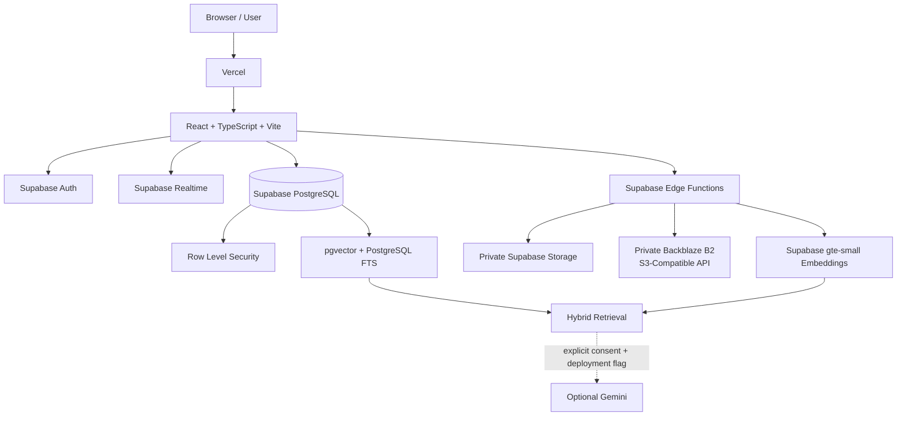

## Hosted Responsibility Split

| Layer | Responsibility |
|---|---|
| Vercel | Frontend hosting and SPA delivery |
| React + TypeScript | Product UI, routing, state and upload orchestration |
| Supabase Auth | Authentication, sessions, password recovery and MFA |
| PostgreSQL | File, folder, version, sharing, activity, AI and configuration metadata |
| Row Level Security | Owner-level authorization below the UI |
| Supabase Realtime | Live synchronization of product state |
| Supabase Storage | Private direct object storage |
| Backblaze B2 | Private S3-compatible large-object storage |
| Supabase Edge Functions | Trusted storage, sharing, search and lifecycle workflows |
| pgvector | Vector similarity retrieval |
| PostgreSQL FTS | Lexical full-text retrieval |
| Supabase AI | `gte-small` embedding generation |
| Gemini | Optional consent-gated grounded generation |

The frontend never receives long-lived Backblaze credentials or Supabase service-role credentials.

Trusted storage and lifecycle operations remain on the server side.

---

## Hosted Request Flow

A typical authenticated CloudVault request follows this model:

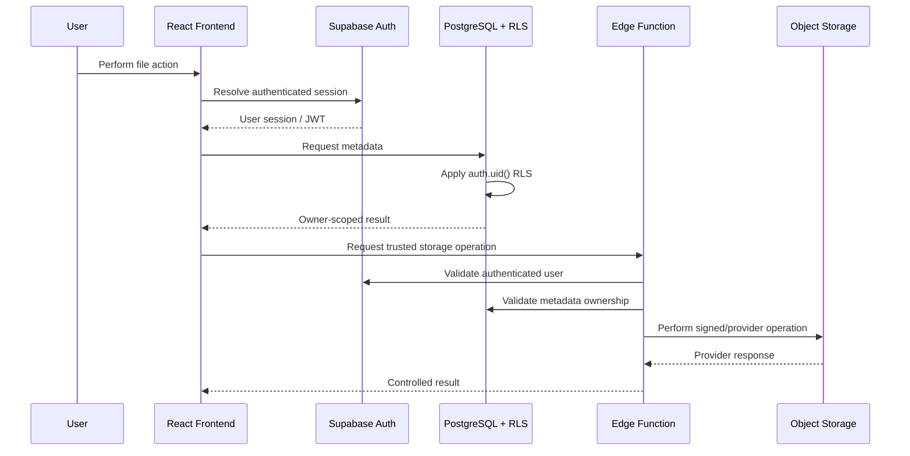

This ensures that ownership validation is not dependent on frontend state.

---

# Local Distributed-Systems Architecture

The local profile uses independent infrastructure services for backend engineering and distributed-systems experimentation.

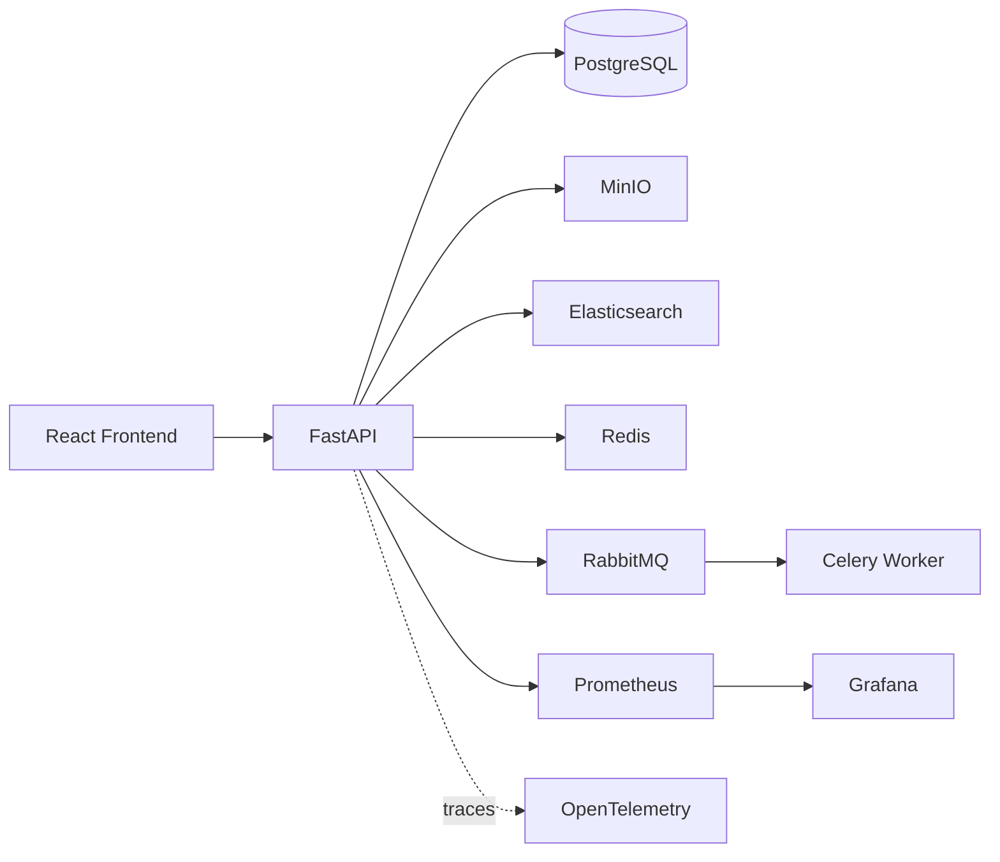

## Local Components

| Component | Role |
|---|---|
| FastAPI | Main Python API layer |
| PostgreSQL | Relational application state |
| MinIO | Local S3-compatible object storage |
| Redis | Fast state and supporting distributed workflows |
| RabbitMQ | Message broker |
| Celery | Background task processing |
| Elasticsearch | Search infrastructure |
| Prometheus | Metrics collection |
| Grafana | Monitoring dashboards |
| OpenTelemetry | Vendor-neutral distributed tracing |
| Docker Compose | Multi-service orchestration |

The API container and background worker are separated so long-running or compute-heavy work does not need to block synchronous API requests.
---

# Large-File Storage Architecture

Large-file handling is one of the central engineering areas of CloudVault.

The platform separates three concerns:

1. the **product upload policy**
2. the **direct-upload limit**
3. the **large-object storage provider**

This avoids coupling the product's maximum file size to the limitations of a single storage backend.

---

## Upload Policy

Current runtime configuration:

| Setting | Current Value |
|---|---:|
| Product upload ceiling | 1.5 GiB per file |
| Supabase direct-upload ceiling | 50 MB |
| Large-object provider | Backblaze B2 |
| Multipart part size | 16 MiB |
| Multipart parallelism | 3 |
| Retry attempts per failed part | 4 |

Files within the direct-upload threshold can use private Supabase Storage.

Files above that threshold are routed through the configured large-object path.

The current architecture is therefore:

```text
Small / medium files
        |
        v
Private Supabase Storage

Large files
        |
        v
Backblaze B2 multipart upload
```

---

## Upload Decision Flow

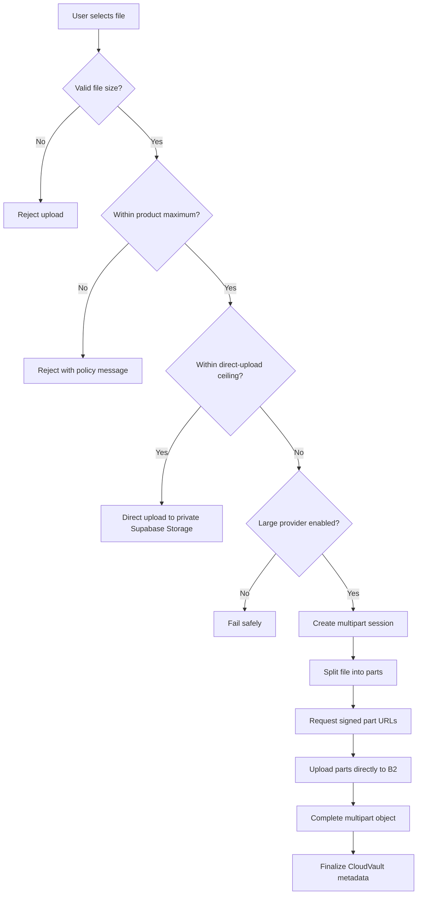

The frontend does not silently fall back to an unintended provider if large-object storage is unavailable.

CloudVault fails explicitly instead.

---

# Multipart Upload Lifecycle

A large upload moves through several stages:

```text
Preparing
   |
Initiated
   |
Uploading
   |
+-----------------------------+
|                             |
Pause                    Part Failure
|                             |
Resume                 Retry + Backoff
|                             |
+-------------+---------------+
              |
         Completing
              |
          Completed
```

CloudVault keeps track of:

- upload session
- storage provider
- provider upload ID
- object key
- target file
- destination folder
- file size
- part size
- version number
- replacement relationship
- current upload state

The upload session acts as the control record for the multipart lifecycle.

---

## Parallel Multipart Upload

Large files are split into multiple parts.

For example, a 64 MiB file using 16 MiB parts becomes:

```text
64 MiB File
   |
   +-- Part 1: 16 MiB
   +-- Part 2: 16 MiB
   +-- Part 3: 16 MiB
   +-- Part 4: 16 MiB
```

The browser can upload several parts concurrently.

Current multipart parallelism:

```text
3
```

This improves throughput without creating uncontrolled browser concurrency.

---

# Signed Part Uploads

Backblaze B2 application credentials remain inside trusted Supabase Edge Functions.

The browser never receives the long-lived provider credentials.

Instead, the workflow is:

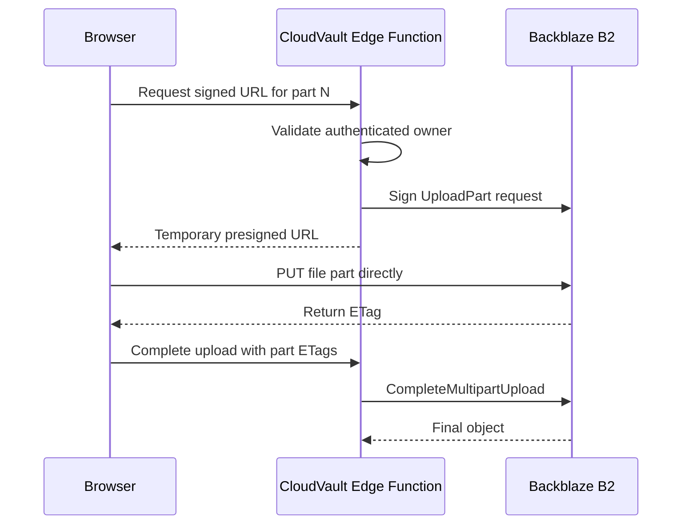

This design avoids routing the large binary payload through the Edge Function itself.

The trusted function controls authorization and signing, while the browser transfers the actual file parts directly to the object provider.

---

# Pause and Resume

Multipart uploads support user-controlled pause and resume.

When an upload is paused:

- active browser part requests are stopped
- the CloudVault multipart session remains available
- completed provider parts remain stored
- already completed parts do not need to be re-uploaded

When resumed:

- CloudVault checks the upload session
- already completed parts are identified
- only the missing parts continue

This is more efficient than restarting the entire file after an interruption.

---

# Retry Strategy

A temporary failure in one part should not destroy the whole upload.

Individual part failures therefore use bounded retry logic with backoff.

Conceptually:

```text
Attempt 1
   |
Failure
   |
Wait
   |
Attempt 2
   |
Failure
   |
Longer Wait
   |
Attempt 3
```

Retries remain bounded so a permanently failing operation does not create an infinite request loop.

---

# Browser Refresh Recovery

Large-upload recovery is designed around the CloudVault multipart session.

The browser keeps the CloudVault session identifier while the storage provider remains the source of truth for uploaded parts.

After a refresh, CloudVault can recover the upload by:

1. recovering the CloudVault multipart session
2. reading the provider recorded on that session
3. requesting the multipart status
4. querying the provider for completed parts
5. calculating the missing parts
6. continuing only those missing parts
7. completing the multipart object
8. finalizing file and version metadata

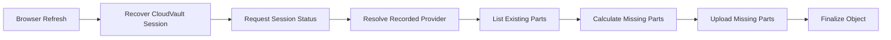

The goal is to preserve progress rather than starting the entire transfer again.

---

# Why the Provider Is Stored Per Session

Each multipart session records the provider that was selected when the upload began.

This matters because runtime configuration may change while an upload is still in progress.

Example:

```text
Upload begins using B2
        |
Product configuration changes later
        |
Existing upload must still finish against B2
```

The existing session therefore continues against its recorded provider instead of blindly using the newest global configuration.

This prevents provider drift during long-running uploads.

---

# Completion Recovery

One important failure boundary occurs when:

1. the object provider successfully completes the multipart object
2. the browser loses the response
3. PostgreSQL metadata has not yet been finalized

CloudVault includes recovery logic for this boundary.

Instead of automatically creating another object, the completion workflow can inspect provider state and determine whether the multipart object already exists.

If it does, CloudVault can safely finalize metadata instead of duplicating the upload.

This helps make multipart completion more resilient to network interruption.

---

# Direct Upload vs Multipart Upload

| Capability | Direct Upload | Multipart Upload |
|---|---|---|
| Current target | Supabase Storage | Backblaze B2 |
| Intended use | Smaller files | Large files |
| Parallel parts | No | Yes |
| Pause/resume | No multipart recovery | Supported |
| Provider part recovery | No | Yes |
| Browser direct-to-provider | Yes | Yes, via presigned URLs |
| Provider stored in metadata | Yes | Yes |
| Version-aware | Yes | Yes |

The two upload paths share the same CloudVault metadata and lifecycle model even though the underlying object provider differs.

---

# Storage Provider Abstraction

CloudVault keeps provider-aware metadata so file lifecycle operations can resolve the correct object store.

Supported provider identities in the architecture include:

```text
supabase
b2
r2
```

Backblaze B2 is the current primary large-object provider.

Cloudflare R2 compatibility remains in the codebase, but the active large-object production configuration is centered on B2.

Provider-aware metadata is used by:

- downloads
- file replacements
- file versions
- version restoration
- secure sharing
- Trash
- permanent file purge
- permanent folder purge

This prevents lifecycle operations from assuming that every object lives in the same storage system.

---

# Private Backblaze B2 Design

The Backblaze B2 bucket remains private.

CloudVault does not expose bucket objects publicly.

The production design uses:

- private bucket access
- scoped B2 application credentials
- server-side secret storage
- presigned multipart part URLs
- signed downloads
- controlled browser CORS
- explicit provider enablement
- provider-aware object deletion

The browser receives temporary access only for the specific object operation it needs.

Long-lived B2 credentials remain outside frontend code.

---

## B2 CORS

Browser multipart uploads require B2 to accept requests from the deployed frontend.

The B2 bucket CORS configuration therefore allows the production Vercel origin pattern and exposes the `ETag` response header.

The ETag is important because multipart completion requires the identifier returned for each uploaded part.

Without the exposed ETag, the browser can upload a part successfully but cannot correctly complete the multipart session.

---

# Production Large-Upload Validation

CloudVault deliberately separates:

```text
Architecture implemented
        !=
Production behavior fully verified
```

The runtime policy is currently configured for:

```text
1.5 GiB per file
```

but the exact 1.5 GiB ceiling is not yet presented as fully production-verified.

A real browser upload above the former direct-upload threshold has already been validated.

Verified production test:

```text
File size: 64 MiB
Provider: Backblaze B2
Multipart part size: 16 MiB
Total parts: 4
Result: successful browser upload
```

This confirmed that:

- the browser routed the file to the B2 path
- authenticated multipart initiation succeeded
- presigned part uploads worked
- B2 browser CORS worked
- ETags were returned correctly
- multipart completion succeeded
- CloudVault metadata finalized successfully

This proves the large-object path works beyond the 50 MB direct-upload limit.

---

## 1.5 GiB Validation Status

CloudVault is currently:

```text
Configured for 1.5 GiB
        |
        +-- large-object provider connected
        +-- multipart path operational
        +-- >50 MB browser upload validated
        |
        +-- exact 1.5 GiB browser upload still to be tested
```

A full 1.5 GiB production claim should only be made after a real full-size upload completes successfully end-to-end.

The final validation should include:

- upload initiation
- multipart transfer
- pause
- resume
- browser refresh
- multipart-session recovery
- completion
- signed download
- public sharing
- file replacement
- historical version access
- version restoration
- Trash and restore
- permanent provider purge

This keeps CloudVault's documentation aligned with actual production evidence.

---

# Large-File Engineering Principle

The upload subsystem follows a simple rule:

> **The product limit, transport strategy, and object-storage provider should remain separate concerns.**

This makes it possible to change the storage provider or direct-upload threshold without rewriting the entire CloudVault file lifecycle architecture.
---

# Security Architecture

Security in CloudVault is enforced below the frontend.

The React application is treated as the user interface, not the authorization boundary.

CloudVault combines:

- Supabase authentication
- PostgreSQL Row Level Security
- owner-scoped database operations
- private object storage
- trusted Edge Functions
- signed URLs
- hashed share tokens
- server-side provider credentials
- explicit external-AI consent
- provider-aware destructive operations

This creates multiple independent security layers instead of relying only on client-side checks.

---

# Identity and Session Security

CloudVault uses Supabase Auth for identity management.

Implemented account workflows include:

- registration
- email/password sign-in
- session management
- password recovery
- secure password reset
- TOTP MFA enrollment
- MFA challenge
- authenticator factor management
- AAL2 workspace protection

The frontend can react to authentication state, but ownership enforcement remains in PostgreSQL and trusted server-side functions.

---

# PostgreSQL Row Level Security

Private product tables use PostgreSQL Row Level Security.

The core ownership rule is based on:

```sql
auth.uid()
```

Conceptually:

```sql
using ((select auth.uid()) = owner_id)
```

This means a user cannot access another user's data simply by modifying a request in the browser.

RLS protects resources such as:

- `vault_files`
- `vault_folders`
- `file_versions`
- `file_chunks`
- `multipart_uploads`
- `share_links`
- `activity_events`
- `ai_query_events`
- `user_preferences`

The product-settings table is handled differently because it stores shared deployment configuration instead of user-owned private data.

---

## Why RLS Matters

Without database-level authorization, a frontend bug or manipulated request could potentially ask PostgreSQL for data belonging to another account.

With owner-scoped RLS:

```text
Browser Request
      |
Authenticated JWT
      |
PostgreSQL
      |
RLS Policy
      |
auth.uid() == owner_id ?
      |
   +-- Yes -> allowed
   |
   +-- No  -> rejected
```

The ownership boundary therefore remains active even if the UI layer is bypassed.

---

# Storage Isolation

CloudVault keeps object storage private.

## Supabase Storage

Direct-upload object paths are scoped by ownership.

Files are stored through private storage workflows rather than publicly exposed bucket URLs.

The user receives access only through authenticated or signed operations.

## Backblaze B2

Backblaze application credentials remain on the server side.

The browser receives only temporary presigned URLs for a specific operation.

The frontend never receives:

- B2 application secrets
- Supabase service-role credentials
- long-lived provider tokens

This separates trusted provider access from browser-visible application logic.

---

# Secure Sharing

CloudVault supports public sharing without making the underlying storage bucket public.

A share link grants access only to the specific file represented by that link.

## Share-Link Flow

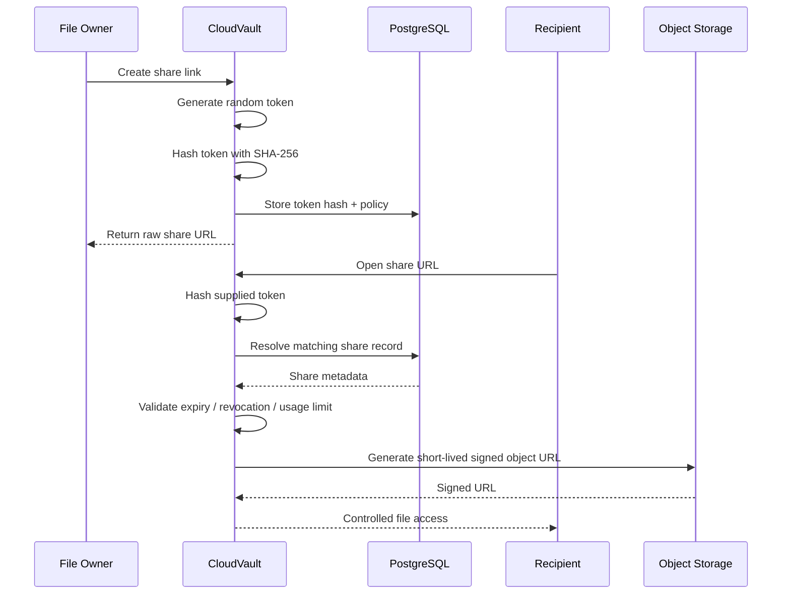

The actual storage object remains private.

---

# Raw Share Tokens Are Not Stored

When a share link is created, the original token is returned to the owner.

CloudVault stores:

```text
SHA-256(token)
```

instead of:

```text
raw token
```

This reduces the impact of database exposure because the original access token is not persisted.

The raw token exists only in the generated share URL.

---

# Share Controls

A CloudVault share link can include:

- expiration time
- maximum usage count
- live usage count
- revocation state
- provider-aware object resolution

Usage-limited share links are consumed atomically.

This avoids a race where multiple simultaneous requests independently read the same stale usage count and all pass validation.

Conceptually:

```text
Validate token
      |
Check expiry
      |
Check revocation
      |
Check usage limit
      |
Increment usage
      |
Return controlled access
```

These steps are handled as one controlled operation.

---

# Public Share Resolution

Public share links are resolved through a trusted Edge Function.

The function:

1. receives the share token
2. hashes the token
3. resolves the corresponding share record
4. atomically validates its policy
5. identifies the file's storage provider
6. creates a short-lived signed URL
7. returns controlled access to the recipient

The same sharing model works whether the underlying object is stored in Supabase Storage or Backblaze B2.

---

# File Lifecycle Management

CloudVault separates logical lifecycle state from physical object storage.

A file can move through states such as:

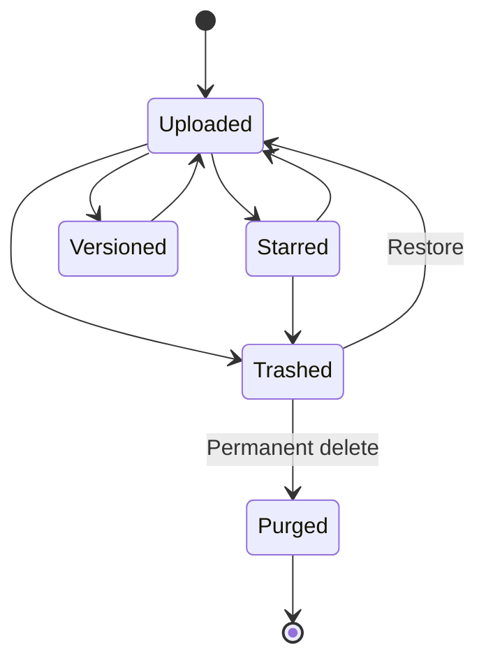

This means moving a file to Trash does not immediately destroy the underlying object.

---

# Soft Delete

Moving a file to Trash first puts it into a recoverable deleted state.

This provides:

- safer destructive operations
- user recovery
- a dedicated Trash experience
- a separate permanent-purge boundary

The metadata lifecycle and the physical object lifecycle are intentionally separated.

---

# Permanent Purge

Permanent deletion is provider-aware.

CloudVault must remove:

- current provider object
- historical provider-backed versions when applicable
- associated metadata
- search/index records
- lifecycle references

This prevents orphaned storage objects from remaining after metadata deletion.

A permanent purge therefore cannot assume that all objects exist in the same provider.

---

# Recoverable Folder Lifecycle

Folder deletion is more complex than deleting a single file.

A folder may contain:

- files
- child folders
- nested descendants
- files with independent lifecycle state
- provider-backed objects

CloudVault therefore treats folder Trash as a hierarchy operation.

## Folder Trash Flow

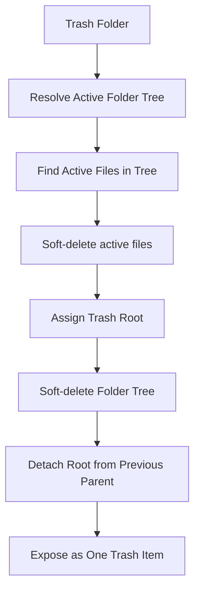

The hierarchy is grouped under one Trash root so it can be restored coherently.

---

# Folder Restore

When restoring a folder hierarchy, CloudVault attempts to return it to its previous parent.

Conceptually:

```text
Restore Trash Root
       |
Previous parent still valid?
       |
    +--+--+
    |     |
   Yes    No
    |     |
Restore   Restore safely
under     without broken
parent    hierarchy
```

This avoids restoring a folder into an invalid or deleted parent.

---

# Why Folder Operations Use Database RPCs

Recursive hierarchy changes can touch multiple related rows.

Using controlled PostgreSQL functions allows the operation to be handled transactionally rather than issuing many disconnected browser updates.

This reduces the risk of partial states such as:

- folder marked deleted while child files remain active
- descendants restored without the root
- activity events written even though the hierarchy update failed
- invalid parent relationships

The database therefore participates directly in lifecycle consistency.

---

# File Versioning

CloudVault uses immutable file version history.

Replacing a file does not destroy the previous version.

Instead, the current version and historical versions remain separately represented.

## Version Model

A file can conceptually look like this:

```text
report.pdf
|
+-- v1  Supabase
|
+-- v2  Backblaze B2
|
+-- v3  Backblaze B2   <- current
```

Historical versions keep their own provider-aware storage information.

This matters because different versions of the same logical file may live in different object stores.

---

# Provider-Aware Versioning

Each version records enough information to locate its own object.

This supports:

- current Supabase file with an older B2 version
- current B2 file with an older Supabase version
- provider changes over time
- historical signed downloads
- version restoration
- provider-aware purge

The current global storage provider does not overwrite the provider identity of historical versions.

---

# Restoring an Older Version

Restoring a historical version does not mutate that historical record.

Instead, CloudVault restores it as a **new current version**.

Example:

```text
v1
v2
v3 current

Restore v1
      |
      v

v1
v2
v3
v4 current  <- content restored from v1
```

This preserves an immutable version timeline and keeps the history audit-friendly.

---

# Activity Audit Trail

CloudVault records meaningful user actions through an activity-event model.

Examples include:

- file upload
- file deletion
- folder deletion
- restoration
- share-link creation
- share-link revocation
- version replacement
- version restoration

Activity records are owner-scoped.

The browser is not given unrestricted authority to create arbitrary audit history.

Trusted workflows create activity events as part of controlled operations.

---

# Security Principles

CloudVault follows several security rules:

1. Authentication alone is not authorization.
2. Ownership checks belong below the frontend.
3. Storage buckets remain private.
4. Long-lived storage credentials never belong in browser code.
5. Public sharing exposes one controlled file, not an entire bucket.
6. Raw share tokens are not persisted.
7. Destructive operations must understand the actual storage provider.
8. External AI access requires explicit consent.
9. Production secrets remain outside Git.
10. Browser-visible Supabase credentials must be publishable credentials only.
11. Service-role access is restricted to trusted server-side workflows.
12. Missing provider metadata should fail closed rather than silently falling back.

---

# Privacy by Design

CloudVault aims to preserve the same privacy model across:

- file browsing
- folder navigation
- version history
- sharing
- search
- related-file retrieval
- grounded evidence
- multipart uploads
- permanent purge

Adding a new capability should not create a weaker authorization path than the rest of the system.

This is especially important for search and AI workflows, where private data could otherwise bypass standard application authorization.
---

# CloudVault Intelligence

CloudVault Intelligence is designed as a retrieval-first system.

It is not intended to behave as a generic chatbot placed on top of a storage interface.

Its purpose is to help users discover relationships, retrieve evidence, and understand information inside their own files while preserving the same ownership and privacy boundaries as the rest of the platform.

---

## Retrieval Pipeline

CloudVault combines:

- semantic embeddings
- vector similarity
- PostgreSQL full-text search
- weighted hybrid ranking
- owner-aware filtering
- file-level deduplication

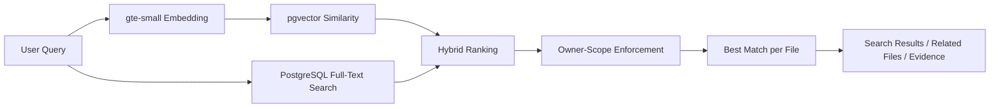

Semantic retrieval helps identify conceptually related content even when the user's wording differs from the document.

Lexical retrieval remains useful for:

- exact names
- technical terms
- identifiers
- phrases
- keywords
- text that semantic retrieval may generalize too aggressively

CloudVault combines both instead of relying on only one retrieval strategy.

---

# Semantic Retrieval

File content is divided into searchable chunks.

Embeddings are generated using:

```text
gte-small
```

The resulting vectors are stored alongside relational metadata and compared using pgvector similarity.

This enables meaning-based retrieval without introducing a completely separate vector-database authorization model.

Because retrieval remains close to PostgreSQL, search can remain aligned with the same owner-scoped data model used by the rest of CloudVault.

---

# Lexical Retrieval

PostgreSQL full-text search provides the lexical side of the retrieval system.

It is useful when the query contains:

- exact terminology
- product or file names
- technical identifiers
- specific phrases
- keywords that should not be semantically generalized

This complements vector similarity rather than replacing it.

---

# Hybrid Ranking

CloudVault combines semantic and lexical relevance signals.

Conceptually:

```text
Final Score =
    semantic_weight × semantic_score
    +
    lexical_weight × lexical_score
```

The ranking weights are configurable through product settings.

This provides a balance between meaning-based retrieval and precise textual relevance.

---

# Permission-Aware Search

Search results are not retrieved globally and then filtered only inside React.

Ownership enforcement remains tied to the authenticated user in the data layer.

This prevents semantic search from becoming a separate path around normal file authorization.

The same privacy boundary applies to:

- semantic search
- lexical search
- hybrid search
- related-file discovery
- grounded evidence retrieval

---

# File-Level Deduplication

Chunk-based retrieval can return several matching chunks from the same file.

CloudVault keeps the strongest relevant result per file when presenting file-level results.

This avoids returning multiple near-duplicate entries from a single document when the user is searching for relevant files.

---

# Related-File Intelligence

The same embedding infrastructure is also used for related-file discovery.

Conceptually:

```text
Current File
     |
Embedding
     |
Similarity Search
     |
Related Files
```

This allows CloudVault to surface relationships between documents that may not be obvious from folder structure alone.

---

# Grounded Evidence Retrieval

CloudVault can retrieve private evidence related to a user's question.

The retrieval process remains useful even if external generation is completely disabled.

Retrieval-only responses can include:

- matching files
- relevant chunks
- semantic relevance
- lexical relevance
- hybrid scores
- grounded evidence

This means the core intelligence layer does not depend on an external LLM.

---

# Optional Grounded Generation

CloudVault supports an optional Gemini-backed generation layer.

Gemini is not allowed to operate as an unrestricted chatbot in this workflow.

The generation stage receives previously retrieved evidence and is intended to answer using that evidence.

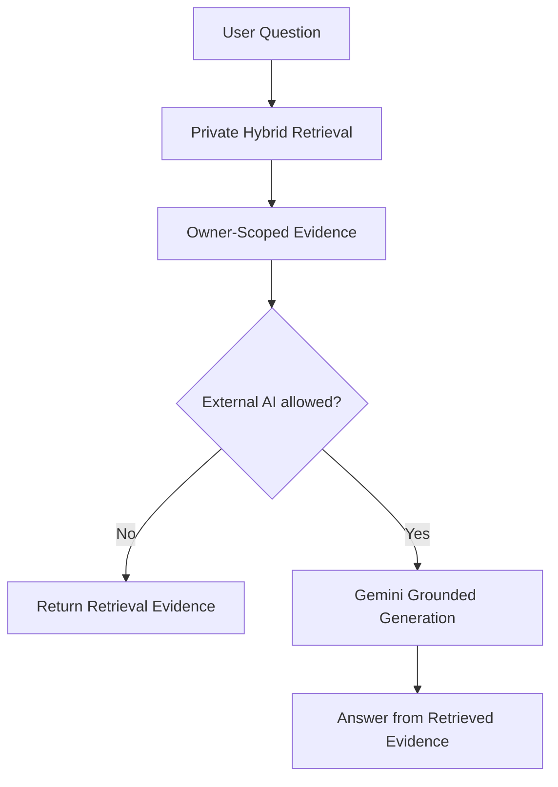

External AI is therefore an optional stage after retrieval rather than the foundation of CloudVault Intelligence.

---

# External AI Consent Model

Private evidence is sent to an external generation provider only when all required conditions are satisfied.

### Condition 1

Generative AI must be enabled for the deployment.

```text
generative_ai_enabled = true
```

### Condition 2

A valid provider credential must exist server-side.

```text
GEMINI_API_KEY
```

### Condition 3

The authenticated user must explicitly enable external AI access.

```text
allow_external_ai = true
```

If any condition is missing, CloudVault remains in retrieval-only mode.

This creates a clear boundary between:

```text
Private Retrieval
       |
       +---- works without external AI

Optional Generation
       |
       +---- requires deployment enablement
       +---- requires server-side credentials
       +---- requires explicit user consent
```

---

# Grounding Rules

The grounded-answer workflow is designed to reduce unsupported generation.

The model is expected to:

- answer from supplied evidence
- avoid relying on unrelated outside knowledge
- state when evidence is insufficient
- reference retrieved evidence
- avoid inventing filenames
- avoid inventing people
- avoid inventing metrics
- avoid inventing project facts

This helps keep the AI layer tied to user-owned information rather than unconstrained generation.

---

# AI Observability

CloudVault records limited AI and retrieval telemetry for engineering visibility.

Tracked metadata can include:

- request type
- provider
- result count
- duration
- execution status

Raw private search queries are not stored in the AI telemetry table.

This provides useful operational data without unnecessarily collecting private user text.

---

# Retrieval Evaluation

The repository includes tooling for retrieval evaluation.

Supported metrics include:

- Precision@K
- Recall@K
- Mean Reciprocal Rank
- nDCG@K

These metrics are intended to be measured against:

- representative indexed documents
- real file chunks
- human-labelled relevance judgments

CloudVault does not publish retrieval-quality scores until meaningful evaluation data exists.

This keeps retrieval claims evidence-based.

---

# Technology Stack

CloudVault combines frontend engineering, backend development, cloud infrastructure, object storage, distributed systems, retrieval systems, AI integration, observability, and DevOps.

## Frontend

| Technology | Role |
|---|---|
| React 19 | Component-based product interface |
| TypeScript | Type-safe frontend development |
| Vite | Development server and production bundling |
| React Router | Application routing |
| Tailwind CSS 4 | Styling pipeline |
| Lucide React | Interface icon system |
| Supabase JavaScript SDK | Auth, database, Realtime, Storage and Edge Function communication |
| Playwright | Responsive browser QA |

Frontend engineering includes:

- authenticated routing
- protected workspace flows
- realtime state updates
- file and folder interaction
- multipart upload orchestration
- responsive layouts
- theme management
- route-level lazy loading
- error handling
- storage-provider-aware UI behavior

---

# Backend Technologies

The local distributed backend is implemented with Python and FastAPI.

| Technology | Role |
|---|---|
| Python 3.12 | Backend runtime |
| FastAPI | REST API framework |
| Uvicorn | ASGI server |
| SQLAlchemy | Database access and ORM |
| Alembic | Database migrations |
| Psycopg | PostgreSQL driver |
| Pydantic Settings | Configuration management |
| PyJWT | JWT handling |
| HTTPX | Async HTTP communication |
| PyPDF | PDF processing support |
| python-docx | DOCX processing support |

The backend is organized around explicit service boundaries rather than placing all infrastructure logic directly inside route handlers.

---

# Database Technologies

## PostgreSQL

PostgreSQL acts as the core relational datastore.

It stores:

- file metadata
- folder hierarchy
- file versions
- multipart sessions
- share-link records
- activity history
- AI retrieval metadata
- user preferences
- product configuration
- searchable document chunks

CloudVault uses PostgreSQL for more than CRUD operations.

Engineering areas include:

- relational schema design
- foreign keys
- constraints
- indexes
- transactions
- recursive folder operations
- Row Level Security
- full-text search
- vector retrieval
- configuration storage
- audit-oriented lifecycle events

---

## pgvector

pgvector is used for semantic similarity retrieval.

Embeddings remain closely connected to relational metadata and ownership rules.

This avoids introducing a separate hosted vector system with another permission model that must be independently synchronized.

---

## PostgreSQL Full-Text Search

PostgreSQL FTS provides lexical relevance.

Together, PostgreSQL FTS and pgvector allow CloudVault to implement hybrid retrieval without requiring another hosted search platform for the production profile.

---

# Supabase

Supabase acts as the primary hosted backend platform.

| Capability | CloudVault Usage |
|---|---|
| Auth | Registration, login, sessions, recovery and MFA |
| PostgreSQL | Application metadata and transactions |
| Row Level Security | Owner-scoped authorization |
| Realtime | Live file, folder and activity synchronization |
| Storage | Private direct object storage |
| Edge Functions | Trusted server-side workflows |
| pgvector | Semantic similarity retrieval |
| Supabase AI | `gte-small` embedding generation |

Supabase therefore provides the hosted control plane for identity, metadata, authorization, realtime behavior, and trusted server-side workflows.

---

# Supabase Edge Functions

Trusted operations that should not execute directly in browser code are implemented through Edge Functions.

CloudVault uses Edge Functions for workflows such as:

- multipart uploads
- signed object URLs
- provider-aware file purge
- recursive folder purge
- version restoration
- semantic search
- grounded answers
- share-link resolution
- document indexing

These functions form an important trust boundary between the browser and privileged infrastructure operations.

---

# Object Storage

CloudVault uses different object-storage technologies depending on the runtime profile.

## Supabase Storage

Used for private direct uploads in the hosted product.

Responsibilities include:

- smaller objects
- authenticated private storage
- signed downloads
- user-scoped object paths

## Backblaze B2

Used as the primary large-object provider.

CloudVault integrates with B2 through its S3-compatible API.

Storage concepts used include:

- private buckets
- multipart uploads
- presigned URLs
- UploadPart
- ListParts
- CompleteMultipartUpload
- AbortMultipartUpload
- signed downloads
- CORS
- object deletion

## MinIO

MinIO is used in the local distributed profile as an S3-compatible object-storage service.

This enables object-storage workflows to be developed and tested locally without requiring an external provider.

---

# Distributed Systems Technologies

## RabbitMQ

RabbitMQ acts as the message broker in the local profile.

It allows asynchronous communication between synchronous API workflows and background workers.

## Celery

Celery provides background processing for work that is:

- asynchronous
- retryable
- expensive
- unsuitable for blocking an API request

The worker runs independently from the main FastAPI application.

## Redis

Redis provides fast state access and supporting infrastructure for distributed workflows.

## Elasticsearch

Elasticsearch is included in the local distributed architecture as a dedicated search infrastructure component.

The hosted product primarily uses PostgreSQL FTS and pgvector, while Elasticsearch remains part of the deeper local systems profile.

---

# DevOps and Deployment

CloudVault uses several tools to keep development and deployment reproducible.

## Docker

Docker images are used for:

- FastAPI backend
- frontend application
- worker runtime

## Docker Compose

Docker Compose orchestrates the local distributed profile.

The stack includes:

```text
PostgreSQL
Redis
RabbitMQ
MinIO
Elasticsearch
FastAPI
Celery Worker
React Frontend
Prometheus
Grafana
```

This creates a realistic multi-service development environment.

---

# GitHub Actions CI

GitHub Actions acts as an automated quality gate.

The pipeline validates:

### Backend

- Ruff linting
- formatting checks
- Pytest
- Python compilation
- Docker image build

### Frontend

- dependency security audit
- TypeScript checks
- production build
- responsive Playwright QA
- Docker image build

### Edge Functions

- Deno static typechecking

CI is used throughout development instead of only before final deployment.

---

# Testing Technologies

## Pytest

Backend tests are executed with Pytest.

## Ruff

Ruff is used for:

- linting
- formatting validation
- import checks
- code-quality rules

## Playwright

Playwright validates browser behavior across:

- Chromium
- WebKit
- phone viewports
- tablet viewports
- desktop viewports

## npm Audit

Frontend dependencies are checked for high-severity vulnerabilities.

## Deno Check

Production Edge Functions are statically validated before changes are considered ready.

---

# Performance Engineering

CloudVault includes measured performance work rather than unsupported claims.

One important frontend optimization was route-level code splitting using React `lazy` and `Suspense`.

Measured production build evidence:

| Build State | Shared JavaScript | Shared gzip |
|---|---:|---:|
| Before route splitting | 530.29 kB | 150.22 kB |
| After route splitting | 445.34 kB | 130.04 kB |

Measured improvement:

- approximately **16% reduction** in shared minified JavaScript
- approximately **13% reduction** in shared gzip JavaScript

These values are build-artifact measurements.

They are not presented as:

- browser network latency
- Core Web Vitals
- production request latency
- scalability benchmarks

This keeps performance documentation precise.

---

# Responsive Engineering

CloudVault is designed for:

- desktop
- tablet
- mobile

Responsive behavior is validated through automated browser tests rather than only manual resizing.

This includes representative viewport classes across Chromium and WebKit.

---

# Observability

CloudVault includes observability for both hosted and local profiles.

## Prometheus

Prometheus collects metrics from the local FastAPI environment.

## Grafana

Grafana provides dashboards for local metrics.

## OpenTelemetry

OpenTelemetry provides vendor-neutral tracing support.

The backend includes:

- trace IDs
- span IDs
- request correlation
- optional OTLP export

This avoids tying the project to a single monitoring vendor.

---

# Engineering Skills Demonstrated

CloudVault demonstrates practical work across several engineering areas.

### Full-Stack Engineering

- React
- TypeScript
- Python
- FastAPI
- authentication
- routing
- realtime state
- responsive UI
- asynchronous browser workflows

### Database Engineering

- PostgreSQL
- relational schema design
- indexes and constraints
- Row Level Security
- recursive hierarchy operations
- transactional functions
- full-text search
- pgvector

### Cloud Engineering

- Supabase
- Vercel
- Backblaze B2
- cloud secret management
- Edge Functions
- CORS
- signed URLs

### Object Storage Engineering

- S3-compatible APIs
- multipart uploads
- presigned URLs
- ETags
- recovery
- provider abstraction
- signed downloads
- provider-aware deletion

### Distributed Systems

- RabbitMQ
- Celery
- Redis
- MinIO
- Elasticsearch
- Docker Compose
- asynchronous workers
- service dependencies

### Security Engineering

- authentication
- authorization
- MFA
- AAL2
- PostgreSQL RLS
- private storage
- token hashing
- least-privilege credentials
- trusted server-side workflows

### AI and Retrieval

- embeddings
- pgvector
- semantic search
- lexical retrieval
- hybrid ranking
- related-document discovery
- grounded generation
- consent-aware AI

### DevOps and Quality

- Docker
- GitHub Actions
- CI/CD
- automated testing
- responsive browser QA
- dependency auditing
- production validation
- observability

---

# Engineering Practices

CloudVault development follows several professional engineering practices.

### Incremental Changes

Features and fixes are implemented as small, reviewable changes instead of uncontrolled rewrites.

### Root-Cause Debugging

Failures are traced to the actual system boundary rather than patched only at the UI layer.

### Least Privilege

Credentials and database permissions remain narrowly scoped.

### Server-Side Trust

Privileged provider operations stay inside trusted backend components.

### Explicit Configuration

Product behavior is controlled through runtime configuration instead of duplicated across frontend constants.

### Evidence-Based Claims

Implemented, configured, measured, and production-verified behavior are documented separately.

### Quality at Every Step

Testing, CI, browser QA, and production checks are part of normal development rather than final cleanup.
---

# Repository Structure

CloudVault keeps the hosted product, local distributed backend, infrastructure, evaluation tooling, documentation, and deployment configuration separated by responsibility.

```text
CloudVault-Distributed-Cloud-Storage-Platform/
│
├── backend/
│   ├── app/
│   ├── migrations/
│   └── tests/
│
├── frontend/
│   ├── src/
│   └── tests/
│
├── supabase/
│   ├── functions/
│   └── migrations/
│
├── evaluation/
│   └── retrieval/
│
├── loadtests/
│
├── infrastructure/
│   └── monitoring/
│
├── docs/
│   ├── B2_SETUP.md
│   └── PRODUCTION_VALIDATION.md
│
├── .github/
│   └── workflows/
│
├── docker-compose.yml
├── vercel.json
├── .env.example
└── README.md
```

This structure keeps product code, backend services, hosted infrastructure, local systems, evaluation, and documentation easy to navigate.

---

# Local Development

CloudVault can be run either as the full distributed profile or as a frontend-only development environment.

## Clone the Repository

```bash
git clone https://github.com/adityamsr2606/CloudVault-Distributed-Cloud-Storage-Platform.git
cd CloudVault-Distributed-Cloud-Storage-Platform
```

---

## Full Distributed Profile

Create the local environment file.

### Linux / macOS

```bash
cp .env.example .env
```

### Windows PowerShell

```powershell
Copy-Item .env.example .env
```

Review the values in `.env`, then start the local stack:

```bash
docker compose up --build
```

The distributed environment includes:

- PostgreSQL
- Redis
- RabbitMQ
- MinIO
- Elasticsearch
- FastAPI
- Celery Worker
- React frontend
- Prometheus
- Grafana

The exact exposed ports should be taken from `docker-compose.yml`.

---

# Frontend-Only Development

For frontend work:

```bash
cd frontend
npm install
npm run dev
```

Required browser-safe Supabase variables:

```text
VITE_SUPABASE_URL
VITE_SUPABASE_PUBLISHABLE_KEY
```

Only publishable browser-safe values should use the `VITE_` prefix.

Supabase service-role credentials and object-storage secrets must never be exposed through frontend environment variables.

---

# Environment Configuration

CloudVault uses `.env.example` as the reference for local environment configuration.

Important variable groups include:

## Local Backend

```text
SECRET_KEY
MINIO_ACCESS_KEY
MINIO_SECRET_KEY
```

These support the local distributed profile.

## Supabase Frontend

```text
VITE_SUPABASE_URL
VITE_SUPABASE_PUBLISHABLE_KEY
```

These values are intended for browser use.

## Backblaze B2

Large-object storage uses server-side values such as:

```text
B2_S3_ENDPOINT
B2_REGION
B2_APPLICATION_KEY_ID
B2_APPLICATION_KEY
B2_BUCKET
```

These values belong only in trusted secret storage.

They must not be:

- committed to Git
- placed in React source code
- exposed through `VITE_` variables
- included in public screenshots
- logged in browser output

## Optional Gemini Configuration

```text
GEMINI_API_KEY
```

Gemini is optional.

CloudVault storage, authentication, uploads, semantic retrieval, and related-file search do not depend on it.

## Optional OpenTelemetry Export

```text
OTEL_EXPORTER_OTLP_ENDPOINT
```

This enables optional export of local backend traces to an OTLP-compatible system.

---

# Deployment

CloudVault's hosted architecture is split across Vercel, Supabase, and Backblaze B2.

## Production Frontend

The production frontend is deployed on Vercel.

**Live Application:**

https://cloudvault-distributed-cloud-storag.vercel.app/

Vercel builds the frontend from the GitHub repository and serves the production SPA.

---

## Supabase Responsibilities

Supabase provides the hosted control plane for CloudVault.

It is responsible for:

- user authentication
- password recovery
- MFA
- PostgreSQL
- Row Level Security
- Realtime
- private direct object storage
- pgvector
- embeddings
- Edge Functions
- product configuration

Database migrations and Edge Function source are versioned inside the repository.

---

## Backblaze B2 Responsibilities

Backblaze B2 provides the large-object storage path.

Production configuration includes:

- private bucket
- scoped application credentials
- S3-compatible endpoint
- browser CORS
- exposed `ETag`
- multipart operations
- provider-aware downloads
- trusted server-side credentials

Detailed provider configuration is documented in:

```text
docs/B2_SETUP.md
```

---

# Runtime Product Configuration

CloudVault does not rely only on build-time constants.

Important product behavior is stored in:

```text
public.product_settings
```

Runtime configuration covers areas such as:

- maximum upload size
- direct-upload ceiling
- active storage provider
- large-object provider
- multipart part size
- multipart parallelism
- B2 enablement
- R2 compatibility
- share-link defaults
- share usage limits
- semantic-search result limits
- related-file limits
- hybrid ranking weights
- chunking settings
- AI enablement
- external generation enablement
- model selection
- MFA policy
- passkey feature gating
- signed-link lifetime
- default theme

This makes deployment policy centrally configurable rather than scattered across frontend constants.

---

# Current Project Status

CloudVault is implemented as a working full-stack platform with both hosted and local distributed architectures.

## Implemented and Validated Areas

The project currently includes engineering validation around:

- React + TypeScript frontend
- private authenticated workspace
- owner-isolated user data
- nested folders
- file upload flows
- file Trash and restore
- recursive folder Trash and restore
- immutable file versions
- secure public share links
- owner-scoped PostgreSQL RLS
- private Supabase Storage
- Supabase Realtime
- TOTP MFA
- AAL2 protection
- route-level code splitting
- responsive browser QA
- GitHub Actions CI
- backend Docker builds
- frontend Docker builds
- Edge Function typechecking
- semantic retrieval
- lexical retrieval
- hybrid ranking
- pgvector
- `gte-small` embeddings
- grounded evidence retrieval
- optional consent-gated external generation
- local FastAPI distributed profile
- Redis
- RabbitMQ
- Celery
- MinIO
- Elasticsearch
- Prometheus
- Grafana
- OpenTelemetry
- Backblaze B2 integration
- provider-aware metadata
- authenticated multipart initiation
- browser multipart upload above 50 MB
- real 64 MiB B2 browser upload
- B2 CORS validation
- B2-backed public share resolution

---

# Configured but Not Yet Fully Production-Verified

The following areas remain intentionally separated from verified production claims:

- exact 1.5 GiB browser upload ceiling
- complete pause/resume validation using very large files
- browser-refresh multipart recovery at large-file scale
- full B2-backed version lifecycle validation at maximum scale
- representative retrieval-quality benchmark
- meaningful production load-test results
- hosted WebAuthn/passkey validation

This distinction is intentional.

CloudVault does not treat:

```text
Implemented
Configured
Measured
Production-verified
```

as interchangeable terms.

---

# Production Validation

Verified production evidence is maintained in:

```text
docs/PRODUCTION_VALIDATION.md
```

The document records:

- infrastructure checks
- production behavior
- storage-provider validation
- browser testing
- measured build evidence
- known constraints
- areas still requiring real-world validation

The goal is to keep the project's claims aligned with actual evidence.

---

# Current Large-Upload State

CloudVault is configured for:

```text
1.5 GiB per file
```

The production B2 multipart path has already been validated with a real browser upload above the 50 MB direct threshold.

Validated example:

```text
64 MiB file
4 × 16 MiB multipart parts
Backblaze B2
Browser upload completed successfully
```

Therefore, CloudVault can accurately claim that its production large-object path works above the direct-upload threshold.

The full 1.5 GiB ceiling should only be described as production-verified after a real 1.5 GiB upload completes successfully end-to-end.

---

# Production Constraints

CloudVault follows a free-first infrastructure strategy.

Some capabilities therefore remain dependent on provider configuration or plan limitations.

## Passkeys

WebAuthn/passkey support remains feature-gated until hosted configuration is fully validated for the production domain.

## Gemini Generation

External generation requires:

- a server-side provider key
- deployment-level enablement
- explicit user consent

Without these conditions, CloudVault stays in retrieval-only mode.

## Large Upload Ceiling

The 1.5 GiB runtime policy is configured, but the exact full-size transfer is not yet presented as production-verified.

## Leaked-Password Protection

Some provider-level protections may depend on the available Supabase plan.

CloudVault keeps its own stronger application-level password requirements as a separate mitigation.

---

# Quality Engineering Summary

CloudVault's quality strategy combines several independent validation layers:

```text
Static Analysis
      +
Automated Tests
      +
Browser QA
      +
Dependency Audits
      +
Docker Validation
      +
Database Inspection
      +
Provider Diagnostics
      +
Production Evidence
      =
Release Confidence
```

No single successful test is treated as proof that the entire platform is correct.

Multiple engineering signals are used together.

---

# Validation Before Claims

CloudVault follows a simple documentation rule:

> **If it has not been measured or tested, it should not be presented as measured or tested.**

This applies to:

- maximum upload behavior
- retrieval quality
- scalability
- production load handling
- latency
- security
- AI quality
- provider reliability

This keeps the README technically credible rather than exaggerated.

---

# Engineering Principles

CloudVault follows several design principles throughout the project.

## 1. Privacy Below the Frontend

The browser should never be the only layer enforcing ownership.

## 2. Fail Closed

Missing or invalid provider configuration should fail explicitly rather than silently using the wrong storage provider.

## 3. Least Privilege

Database access, provider credentials, and application secrets should receive only the permissions required for their role.

## 4. Recoverability

Large uploads and destructive operations should account for interrupted workflows and network failures.

## 5. Immutable History

Historical file versions should remain stable even when old content is restored.

## 6. Provider Awareness

File lifecycle operations must understand where the actual object is stored.

## 7. Explicit AI Boundaries

Private retrieval and third-party generation are separate capabilities.

## 8. Runtime Configuration

Deployment policy should not be duplicated across frontend components.

## 9. Quality at Every Step

Testing, CI, browser QA, and production checks are part of development rather than final cleanup.

## 10. Claims Require Evidence

Architecture, configuration, measurement, and validation are documented separately.

---

# Future Scope

CloudVault's current architecture can be extended in several directions.

Potential future improvements include:

- desktop synchronization client
- progressive web app support
- native mobile workflows
- richer PDF previews
- Office-document previews
- media previews
- OCR for scanned documents
- automated document extraction
- malware scanning
- file quarantine
- team workspaces
- organization accounts
- fine-grained ACL roles
- collaborative folders
- public developer API
- SDKs
- webhooks
- audit export
- disaster-recovery drills
- storage replication
- backup validation
- measured large-scale load testing
- representative retrieval benchmark
- automated deployment validation
- richer AI-assisted organization
- tenant-specific configuration

Future additions should preserve the same owner-isolation and privacy model as the existing system.

---

# What This Project Demonstrates

CloudVault is not intended to demonstrate one framework in isolation.

It combines:

```text
Full-Stack Engineering
        +
Backend Development
        +
Database Engineering
        +
Cloud Storage
        +
Security Engineering
        +
Distributed Systems
        +
DevOps
        +
Observability
        +
AI Retrieval
        +
Testing and QA
        =
CloudVault
```

The project demonstrates how these engineering areas interact inside one coherent system rather than as isolated technology demos.

---

# Documentation

Additional engineering documentation is available in:

## Production Validation

```text
docs/PRODUCTION_VALIDATION.md
```

Contains measured and verified production evidence.

## Backblaze B2 Setup

```text
docs/B2_SETUP.md
```

Contains provider configuration, CORS setup, multipart behavior, and large-file validation guidance.

---

# Contributions

CloudVault is currently maintained as a personal engineering project.

Issues, suggestions, and technically justified improvements can be discussed through GitHub Issues.

Larger changes should remain aligned with the existing architecture, ownership model, and security boundaries.

---

# Security Notes

Do not publish:

- passwords
- Supabase service-role credentials
- Backblaze application keys
- JWTs
- raw share tokens
- private object URLs
- authorization tokens
- other production secrets

Any accidentally exposed credential should be rotated immediately.

---

# Author

## Aditya Mohan Srivastava

CloudVault was designed and developed as a hands-on engineering project focused on:

- full-stack development
- cloud architecture
- distributed systems
- backend engineering
- PostgreSQL and database security
- object storage
- DevOps
- observability
- retrieval-based AI
- production-quality software practices

**GitHub:**  
https://github.com/adityamsr2606

---

# Closing Note

CloudVault is built around a simple idea:

> **A storage platform should not only store files. It should protect ownership, survive failures, preserve history, expose controlled access, remain observable, and make private information easier to retrieve without weakening its security model.**

<div align="center">

## CloudVault

### Private by design. Recoverable by architecture. Intelligent with explicit boundaries.

**Secure Storage · Distributed Systems · Hybrid Retrieval · Production Engineering**

</div>
